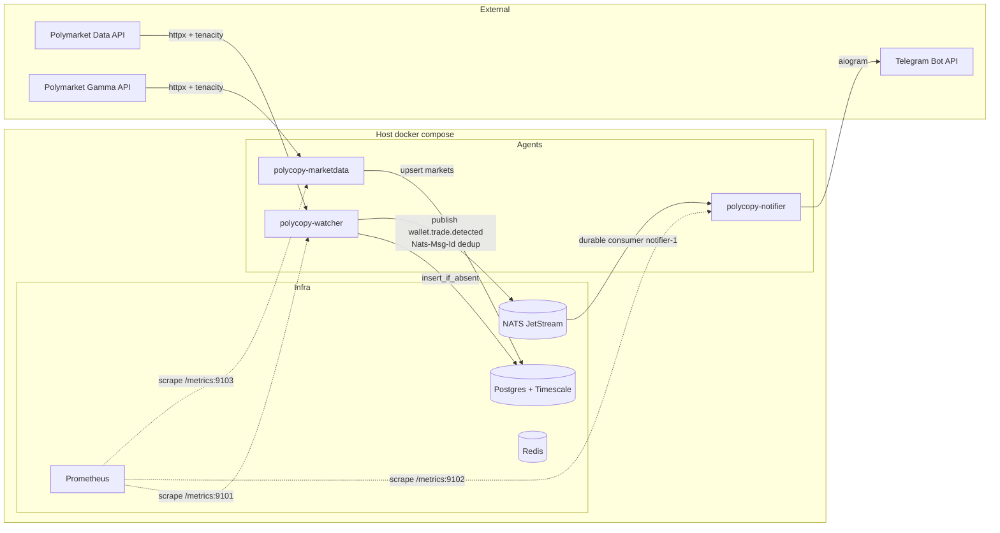

# Polycopy Architecture

Polycopy é um sistema multi-agente de copy trading na Polymarket. Esta nota
documenta a arquitetura **da Fase 1** (watcher + notifier mínimos). Fases
posteriores expandem com risk, sizing, executor, etc — ver `PROMPT_POLYCOPY_v2.md`.

## Visão geral



## Componentes

### Watcher (`src/polycopy/agents/watcher.py`)

Loop assíncrono que itera sobre wallets de `config/wallets_seed.yaml`. Por wallet:

1. Lê cursor `since = repo.latest_occurred_at(wallet)`. Se `None`, bootstrap = `now - WATCHER_BOOTSTRAP_HOURS`.
2. Chama `PolymarketDataClient.fetch_user_activity(wallet, since=since)` — httpx + tenacity (retry 5xx 3x).
3. Pra cada trade retornado: `repo.insert_if_absent(trade)`. Apenas inserts novos (PK `(tx_hash, log_index)`) entram em `inserted_trades`.
4. Publica `WalletTradeDetected` no JetStream pra cada trade novo (`Nats-Msg-Id = tx_hash:log_index`).

Em erro do client (após retries): loga, incrementa métrica `watcher_iterations_total{outcome="error"}`, **continua o loop** (W1).

### Notifier (`src/polycopy/agents/notifier.py`)

Push durable consumer no JetStream (`durable=notifier-1`, `ack_wait=30s`, `max_deliver=5`). Pra cada mensagem:

1. Parse `WalletTradeDetected.model_validate_json(payload)`.
2. Resolve label via `wallets_by_address[trade.wallet]`. Wallet desconhecida → `addr[:8]…`.
3. Formata MarkdownV2 e envia via `aiogram.Bot.send_message`.
4. Sucesso → `msg.ack()`; falha → não acka → JetStream redelivera. Em `num_delivered == max_deliver` e ainda falha, métrica `dropped_max_deliver` é incrementada.

### MarketDataAgent (Plano 2A)

Agente em background que sincroniza metadata dos top N (default 200) mercados ativos
da Polymarket Gamma API pra tabela `markets`. Roda a cada `MARKETDATA_SYNC_INTERVAL_SECONDS`
(default 300s). Falha de sync não derruba copy trading — Risk (Plano 2B) usa lazy fallback
no `MarketRepository` quando o cache está stale ou ausente.

Métricas: `polycopy_marketdata_sync_total{result}`, `polycopy_marketdata_sync_duration_seconds`,
`polycopy_marketdata_markets_tracked`.

Container: `polycopy-marketdata`. Endpoint `/metrics`: porta 9103.

### Bus de eventos

`NatsMessagingBus` (`src/polycopy/infrastructure/messaging/nats_bus.py`) cria stream `WALLET_TRADES` (subject filter `wallet.trade.>`, max_age 7d, file storage, replicas 1) idempotentemente em `connect()`. Suporta:
- `publish_wallet_trade_detected`: JS publish com `Nats-Msg-Id` pra dedup server-side.
- `subscribe(subject, handler, *, durable=None)`: ephemeral se `durable=None`, durable JS consumer caso contrário (ack-explicit).

### Persistência

Tabela `wallet_trades`:
- PK `(tx_hash, log_index)` — dedup natural.
- Índice `(wallet, occurred_at)` pro `latest_occurred_at`.
- Constraint `side IN ('BUY', 'SELL')`.

Migrations gerenciadas por alembic (`alembic/`).

## Como rodar

### Toda a stack via docker compose

```bash
cp .env.example .env  # editar TELEGRAM_BOT_TOKEN, TELEGRAM_CHAT_ID
# Editar config/wallets_seed.yaml com wallets reais
docker compose up -d
docker compose logs -f watcher notifier
```

`/metrics` em:
- watcher: `http://127.0.0.1:9101/metrics`
- notifier: `http://127.0.0.1:9102/metrics`
- marketdata: `http://127.0.0.1:9103/metrics`
- prometheus UI: `http://127.0.0.1:9090/`

### Local sem Docker (dev)

```bash
# Apenas infra
docker compose up -d postgres nats redis prometheus

# Watcher
WATCH_WALLETS=0xabc... uv run python -m polycopy.agents.watcher

# Notifier (em outro terminal)
TELEGRAM_BOT_TOKEN=... TELEGRAM_CHAT_ID=... \
uv run python -m polycopy.agents.notifier
```

## Observabilidade

| Métrica | Tipo | Labels | Onde |
|---------|------|--------|------|
| `polycopy_polymarket_requests` | Counter | `endpoint`, `status` | data_client |
| `polycopy_polymarket_request_duration_seconds` | Histogram | `endpoint` | data_client |
| `polycopy_watcher_iterations` | Counter | `wallet`, `outcome` (`ok\|empty\|error`) | watcher |
| `polycopy_watcher_trades_inserted` | Counter | `wallet` | watcher |
| `polycopy_watcher_iteration_duration_seconds` | Histogram | `wallet` | watcher |
| `polycopy_notifier_messages` | Counter | `outcome` (`sent\|telegram_error\|dropped_max_deliver`) | notifier |
| `polycopy_notifier_send_duration_seconds` | Histogram | — | notifier |
| `polycopy_marketdata_sync_total` | Counter | `result` (`ok\|fail`) | marketdata |
| `polycopy_marketdata_sync_duration_seconds` | Histogram | — | marketdata |
| `polycopy_marketdata_markets_tracked` | Gauge | — | marketdata |

Logs estruturados via `structlog` (JSON em prod, console colorido em dev).

## Decisões registradas

Veja `docs/superpowers/specs/2026-05-01-fase-1c-agentes-design.md`.

## Fora do escopo da Fase 1

Roadmap completo está em `PROMPT_POLYCOPY_v2.md` seção 8. Resumo:

- Fase 2: WebSocket CLOB + Risk + Sizing
- Fase 3: Telegram completo (Commander)
- Fase 4: Executor DRY_RUN + outbox pattern
- Fase 5: Executor real + Reconciler
- Fase 6: Discovery + Scanner + Analyst
- Fase 7: Hardening + Watchdog + PWA
- Fase 8: Otimizações
