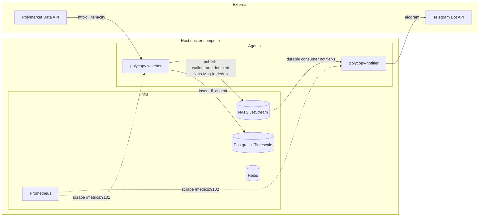

# Plano 1C — Agentes Watcher + Notifier (Implementation Plan)

> **For agentic workers:** REQUIRED SUB-SKILL: Use superpowers:subagent-driven-development (recommended) or superpowers:executing-plans to implement this plan task-by-task. Steps use checkbox (`- [ ]`) syntax for tracking.

**Goal:** Implementar os dois primeiros agentes concretos (`watcher` e `notifier`) cobrindo passos 1.11–1.14 da Fase 1, inclusive migração do `NatsMessagingBus` para JetStream e containerização.

**Architecture:** Watcher faz polling da Polymarket Data API por wallet, persiste trades novos no Postgres com dedup PK e publica `WalletTradeDetected` num stream JetStream. Notifier consome via durable consumer, formata MarkdownV2 e envia ao Telegram via aiogram. Ambos rodam como containers Docker isolados (`polycopy-watcher`, `polycopy-notifier`) com `/metrics` próprios.

**Tech Stack:** Python 3.12, nats-py JetStream, aiogram 3, httpx + tenacity (já instalado), SQLAlchemy async (já instalado), prometheus-client (já instalado), pyyaml.

**Cadência:** one-task-per-confirmation. Cada Task termina com STOP — esperar confirmação humana antes da próxima. Pausa antes de `git add`/`git commit` em cada task (regra `feedback_commits.md`).

**Spec referência:** `docs/superpowers/specs/2026-05-01-fase-1c-agentes-design.md`

---

## File Structure

```
config/
└── wallets_seed.yaml                                        # Task 4

src/polycopy/
├── config.py                                                # Task 2 (modificar)
├── infrastructure/
│   ├── messaging/
│   │   └── nats_bus.py                                      # Task 1 (substituir)
│   ├── observability/
│   │   ├── metrics.py                                       # Task 2 (modificar)
│   │   └── http_metrics.py                                  # Task 2 (novo)
│   ├── telegram/
│   │   ├── __init__.py                                      # Task 5
│   │   └── notifier_client.py                               # Task 5
│   └── wallets_seed.py                                      # Task 4
├── ports/
│   └── messaging.py                                         # Task 1 (modificar — durable kwarg)
└── agents/
    ├── watcher.py                                           # Task 3 + Task 4
    └── notifier.py                                          # Task 5

tests/
├── integration/
│   ├── test_jetstream_bus.py                                # Task 1 (substitui test_nats_bus.py)
│   ├── test_watcher_e2e.py                                  # Task 4
│   └── test_notifier_e2e.py                                 # Task 5
└── unit/
    ├── agents/
    │   ├── test_watcher.py                                  # Task 3 + Task 4
    │   └── test_notifier.py                                 # Task 5
    └── infrastructure/
        ├── test_metrics.py                                  # Task 2 (modificar)
        ├── test_telegram_notifier.py                        # Task 5
        └── test_wallets_seed.py                             # Task 4

Dockerfile.agent                                             # Task 6
docker-compose.yml                                           # Task 6 (modificar)
infra/prometheus/prometheus.yml                              # Task 6 (modificar)
.env.example                                                 # Task 2 + Task 5 + Task 6
ARCHITECTURE.md                                              # Task 6
pyproject.toml                                               # Task 5 (deps), Task 4 (pyyaml)
```

---

## Task 1: Migrar `NatsMessagingBus` para JetStream

**Objetivo:** substituir o core NATS pub/sub do `NatsMessagingBus` por JetStream, com stream `WALLET_TRADES` criado idempotentemente, dedup server-side via `Nats-Msg-Id`, e durable consumer opcional via novo kwarg `durable`. Refazer testes integration.

**Files:**
- Modify: `src/polycopy/ports/messaging.py` (assinatura do `subscribe`)
- Modify: `src/polycopy/infrastructure/messaging/nats_bus.py` (substituir core por JetStream)
- Replace: `tests/integration/test_nats_bus.py` → `tests/integration/test_jetstream_bus.py`

---

- [ ] **Step 1.1: Atualizar `src/polycopy/ports/messaging.py`** — adicionar kwarg `durable` em `subscribe`

```python
"""MessagingPort: contrato para publicar/assinar eventos no bus (NATS no Plano 1B)."""

from __future__ import annotations

from collections.abc import Awaitable, Callable
from typing import Protocol

from polycopy.domain.events import WalletTradeDetected

EventHandler = Callable[[bytes], Awaitable[None]]
"""Handler para subscribe ephemeral (sem ack manual)."""

DurableEventHandler = Callable[[bytes, int], Awaitable[None]]
"""Handler para subscribe durable. Recebe (payload, num_delivered).

`num_delivered` é o número da tentativa atual (1 na primeira entrega, N após
redeliveries). Útil pra detectar mensagens prestes a serem descartadas
(num_delivered == max_deliver) e instrumentar métricas adequadas.
"""


class MessagingPort(Protocol):
    """Bus de eventos. Implementação concreta: NATS JetStream (Plano 1C)."""

    async def publish_wallet_trade_detected(self, event: WalletTradeDetected) -> None:
        """Publica evento no subject `wallet.trade.detected`."""
        ...

    async def subscribe(
        self,
        subject: str,
        handler: EventHandler | DurableEventHandler,
        *,
        durable: str | None = None,
    ) -> None:
        """Assina subject. Se `durable` é dado, cria push durable consumer JetStream
        e o handler deve ser `DurableEventHandler` (recebe `num_delivered`).
        Caso contrário, ephemeral subscribe e handler é `EventHandler`."""
        ...

    async def close(self) -> None:
        """Fecha conexão com graceful drain."""
        ...
```

- [ ] **Step 1.2: Substituir `tests/integration/test_nats_bus.py` por `tests/integration/test_jetstream_bus.py`**

Primeiro, deletar o arquivo antigo:

Run: `rm tests/integration/test_nats_bus.py`

Em seguida, criar `tests/integration/test_jetstream_bus.py`:

```python
"""Integration tests for NatsMessagingBus (JetStream) — requer NATS up no docker-compose."""

from __future__ import annotations

import asyncio
from datetime import UTC, datetime
from decimal import Decimal
from uuid import uuid4

import pytest

from polycopy.config import Settings
from polycopy.domain.events import WalletTradeDetected
from polycopy.domain.models import Side, Trade
from polycopy.domain.value_objects import (
    ConditionId,
    Money,
    Price,
    TokenId,
    WalletAddress,
)
from polycopy.infrastructure.messaging.nats_bus import NatsMessagingBus
from polycopy.ports import MessagingPort

pytestmark = pytest.mark.integration


def _trade(*, tx_hash: str = "0x" + "cd" * 32, log_index: int = 0) -> Trade:
    return Trade(
        tx_hash=tx_hash,
        log_index=log_index,
        wallet=WalletAddress(value="0x" + "1" * 40),
        condition_id=ConditionId(value="0x" + "ab" * 32),
        token_id=TokenId(value="42"),
        side=Side.BUY,
        price=Price(value=Decimal("0.5")),
        size_usdc=Money.from_usdc("10"),
        occurred_at=datetime.now(tz=UTC),
    )


def _event(*, tx_hash: str = "0x" + "cd" * 32, log_index: int = 0) -> WalletTradeDetected:
    return WalletTradeDetected(
        event_id=uuid4(),
        occurred_at=datetime.now(tz=UTC),
        trade=_trade(tx_hash=tx_hash, log_index=log_index),
    )


@pytest.fixture
async def bus(settings: Settings) -> NatsMessagingBus:
    """Bus conectado; testes finalizam com `await bus.close()`."""
    b = NatsMessagingBus(url=settings.nats_url)
    await b.connect()
    return b


async def test_durable_subscribe_receives_published_event(bus: NatsMessagingBus) -> None:
    received: list[tuple[bytes, int]] = []

    async def handler(payload: bytes, num_delivered: int) -> None:
        received.append((payload, num_delivered))

    await bus.subscribe(WalletTradeDetected.SUBJECT, handler, durable="test-1")
    await asyncio.sleep(0.05)

    event = _event(tx_hash="0x" + "01" * 32, log_index=0)
    await bus.publish_wallet_trade_detected(event)

    for _ in range(20):
        if received:
            break
        await asyncio.sleep(0.05)

    await bus.close()
    assert len(received) == 1
    payload, num_delivered = received[0]
    assert num_delivered == 1
    parsed = WalletTradeDetected.model_validate_json(payload)
    assert parsed.event_id == event.event_id


async def test_publish_dedup_by_msg_id(bus: NatsMessagingBus) -> None:
    received: list[bytes] = []

    async def handler(payload: bytes, num_delivered: int) -> None:
        received.append(payload)

    await bus.subscribe(WalletTradeDetected.SUBJECT, handler, durable="test-2")
    await asyncio.sleep(0.05)

    # Mesmo tx_hash + log_index → mesmo Nats-Msg-Id → JetStream dedupa server-side
    event_a = _event(tx_hash="0x" + "02" * 32, log_index=0)
    event_b = _event(tx_hash="0x" + "02" * 32, log_index=0)
    await bus.publish_wallet_trade_detected(event_a)
    await bus.publish_wallet_trade_detected(event_b)

    await asyncio.sleep(0.3)
    await bus.close()
    assert len(received) == 1


async def test_handler_exception_triggers_redelivery(bus: NatsMessagingBus) -> None:
    attempts: list[int] = []

    async def handler(payload: bytes, num_delivered: int) -> None:
        attempts.append(num_delivered)
        if num_delivered < 3:
            raise RuntimeError("simulated failure")

    await bus.subscribe(WalletTradeDetected.SUBJECT, handler, durable="test-3")
    await asyncio.sleep(0.05)

    event = _event(tx_hash="0x" + "03" * 32, log_index=0)
    await bus.publish_wallet_trade_detected(event)

    # Aguarda até 3 entregas (max_deliver=5; ack_wait pode ser overridden no test)
    deadline = asyncio.get_event_loop().time() + 5.0
    while len(attempts) < 3 and asyncio.get_event_loop().time() < deadline:
        await asyncio.sleep(0.1)

    await bus.close()
    assert attempts[:3] == [1, 2, 3]


async def test_close_is_idempotent(bus: NatsMessagingBus) -> None:
    await bus.close()
    await bus.close()  # não deve levantar


async def test_publish_without_connect_raises(settings: Settings) -> None:
    fresh = NatsMessagingBus(url=settings.nats_url)
    with pytest.raises(RuntimeError, match="not connected"):
        await fresh.publish_wallet_trade_detected(_event())


def _accepts(_: MessagingPort) -> None:
    return


async def test_adapter_satisfies_protocol(bus: NatsMessagingBus) -> None:
    _accepts(bus)
    await bus.close()
```

**Nota:** `test_handler_exception_triggers_redelivery` depende de `ack_wait` curto. Se a implementação usar `ack_wait=30s` default, esse teste vai expirar. Vou expor `ack_wait_seconds` como parâmetro de `subscribe` (default 30) e o teste passa `ack_wait_seconds=1`. Adicionar isso à assinatura do `subscribe` no port também.

Atualizar `src/polycopy/ports/messaging.py` para incluir o kwarg:

```python
    async def subscribe(
        self,
        subject: str,
        handler: EventHandler | DurableEventHandler,
        *,
        durable: str | None = None,
        ack_wait_seconds: int = 30,
        max_deliver: int = 5,
    ) -> None:
        ...
```

E o teste `test_handler_exception_triggers_redelivery` deve chamar:
```python
await bus.subscribe(
    WalletTradeDetected.SUBJECT, handler,
    durable="test-3", ack_wait_seconds=1, max_deliver=5,
)
```

(Atualize esse teste de acordo antes de rodar.)

- [ ] **Step 1.3: Run — esperado FAIL**

Run: `uv run pytest tests/integration/test_jetstream_bus.py -v`
Expected: erros de tipos / chamadas (`subscribe` ainda não aceita `durable`).

- [ ] **Step 1.4: Substituir `src/polycopy/infrastructure/messaging/nats_bus.py`**

```python
"""NatsMessagingBus: adapter de MessagingPort usando JetStream.

Stream `WALLET_TRADES`:
- Subject filter: `wallet.trade.>`
- Retention: limits (default)
- Max age: 7 dias
- Storage: file
- Replicas: 1 (single-node na fase 1)

Dedup server-side via `Nats-Msg-Id` header (formato: `tx_hash:log_index`).

Subscribe pode ser:
- Ephemeral (durable=None): handler `EventHandler` (sem ack manual; entrega best-effort)
- Durable (durable=str): handler `DurableEventHandler` (recebe num_delivered;
  ack manual após sucesso, redeliver em exception até `max_deliver`)
"""

from __future__ import annotations

import inspect
from typing import cast

import nats
from nats.aio.client import Client as NatsClient
from nats.aio.msg import Msg
from nats.js import JetStreamContext
from nats.js.api import (
    ConsumerConfig,
    DeliverPolicy,
    RetentionPolicy,
    StorageType,
    StreamConfig,
)
from nats.js.errors import BadRequestError

from polycopy.domain.events import WalletTradeDetected
from polycopy.ports.messaging import DurableEventHandler, EventHandler

_STREAM_NAME = "WALLET_TRADES"
_STREAM_SUBJECTS = ["wallet.trade.>"]
_STREAM_MAX_AGE_S = 7 * 24 * 3600


class NatsMessagingBus:
    """Adapter JetStream de `MessagingPort`."""

    def __init__(self, *, url: str) -> None:
        self._url = url
        self._nc: NatsClient | None = None
        self._js: JetStreamContext | None = None

    async def connect(self) -> None:
        if self._nc is not None and self._nc.is_connected:
            return
        self._nc = await nats.connect(self._url)
        self._js = self._nc.jetstream()
        await self._ensure_stream()

    async def _ensure_stream(self) -> None:
        assert self._js is not None
        config = StreamConfig(
            name=_STREAM_NAME,
            subjects=_STREAM_SUBJECTS,
            retention=RetentionPolicy.LIMITS,
            max_age=_STREAM_MAX_AGE_S,
            storage=StorageType.FILE,
            num_replicas=1,
            duplicate_window=300,  # 5min: dedup window por Nats-Msg-Id
        )
        try:
            await self._js.add_stream(config=config)
        except BadRequestError:
            # Stream já existe com config compatível — ok.
            pass

    async def publish_wallet_trade_detected(self, event: WalletTradeDetected) -> None:
        if self._nc is None or not self._nc.is_connected or self._js is None:
            raise RuntimeError("NatsMessagingBus not connected; call connect() first")
        payload = event.model_dump_json().encode("utf-8")
        msg_id = f"{event.trade.tx_hash}:{event.trade.log_index}"
        await self._js.publish(
            WalletTradeDetected.SUBJECT,
            payload,
            headers={"Nats-Msg-Id": msg_id},
        )

    async def subscribe(
        self,
        subject: str,
        handler: EventHandler | DurableEventHandler,
        *,
        durable: str | None = None,
        ack_wait_seconds: int = 30,
        max_deliver: int = 5,
    ) -> None:
        if self._nc is None or not self._nc.is_connected or self._js is None:
            raise RuntimeError("NatsMessagingBus not connected; call connect() first")

        if durable is None:
            ephemeral_handler = cast(EventHandler, handler)

            async def _ephemeral_wrapper(msg: Msg) -> None:
                await ephemeral_handler(msg.data)

            await self._nc.subscribe(subject, cb=_ephemeral_wrapper)
            return

        durable_handler = cast(DurableEventHandler, handler)

        async def _durable_wrapper(msg: Msg) -> None:
            num_delivered = msg.metadata.num_delivered or 1
            try:
                await durable_handler(msg.data, num_delivered)
            except Exception:
                # Não acka — JetStream redelivera até max_deliver.
                return
            await msg.ack()

        await self._js.subscribe(
            subject,
            durable=durable,
            cb=_durable_wrapper,
            config=ConsumerConfig(
                ack_wait=ack_wait_seconds,  # nats-py 2.10+: float em segundos
                max_deliver=max_deliver,
                deliver_policy=DeliverPolicy.NEW,
            ),
        )

    async def close(self) -> None:
        if self._nc is None:
            return
        if self._nc.is_connected:
            await self._nc.drain()
        self._nc = None
        self._js = None


# Sanity-check em import: tipos esperados existem.
assert inspect.iscoroutinefunction(NatsMessagingBus.connect)
```

- [ ] **Step 1.5: Run — esperado PASS**

Run: `uv run pytest tests/integration/test_jetstream_bus.py -v`
Expected: 6 tests passados.

Se `test_publish_dedup_by_msg_id` falhar com 2 mensagens recebidas: confira `duplicate_window` no `StreamConfig` (5min é folgado pra teste).

Se `test_handler_exception_triggers_redelivery` flakey: aumente o `deadline` ou diminua `ack_wait_seconds` pra 1 (já está). Em raras execuções lentas, o JetStream redelivery pode atrasar.

**Compatibilidade `ack_wait`:** em `nats-py>=2.10`, `ConsumerConfig.ack_wait` é float em segundos. Se você estiver em uma versão mais antiga (< 2.10) que espera nanosegundos, multiplique por `10**9` na implementação. Confira `python -c "import nats; print(nats.__version__)"` se houver dúvida.

Em ambiente CI: o stream `WALLET_TRADES` persiste entre testes (NATS file storage com volume). Limpar manualmente entre runs locais se quiser:
```bash
docker exec polycopy-nats nats stream rm WALLET_TRADES --force 2>/dev/null || true
```

(Opcional: adicionar fixture `_reset_stream` que faz isso. Não obrigatório agora.)

- [ ] **Step 1.6: Run full quality gate**

```bash
uv run ruff check .
uv run ruff format --check .
uv run mypy src
uv run pytest
```
Expected: todos exit 0. Test count: 80 anteriores - 4 (test_nats_bus.py) + 6 (jetstream) = 82.

- [ ] **Step 1.7: Stage e commit**

Pause antes.
```bash
git add src/polycopy/ports/messaging.py src/polycopy/infrastructure/messaging/nats_bus.py tests/integration/test_jetstream_bus.py tests/integration/test_nats_bus.py
git status
git commit -m "refactor(messaging): migrate NatsMessagingBus to JetStream with durable consumer support"
```

(O `git add tests/integration/test_nats_bus.py` registra a deleção do arquivo.)

- [ ] **Step 1.8: STOP — esperar confirmação humana antes de Task 2**

---

## Task 2: Configs novas + métricas dos agentes + servidor `/metrics`

**Objetivo:** adicionar todas as configs necessárias pros agentes (`Settings`), expandir o `Metrics` dataclass com counters/histograms de watcher e notifier, criar helper `start_metrics_server` que sobe `prometheus_client.start_http_server` em porta dedicada, e atualizar `.env.example`. Sem parser YAML ainda (entra na Task 4).

**Files:**
- Modify: `src/polycopy/config.py`
- Modify: `src/polycopy/infrastructure/observability/metrics.py`
- Create: `src/polycopy/infrastructure/observability/http_metrics.py`
- Modify: `tests/unit/infrastructure/test_metrics.py`
- Create: `tests/unit/infrastructure/test_http_metrics.py`
- Modify: `.env.example`

---

- [ ] **Step 2.1: Modificar `src/polycopy/config.py`**

Substituir o conteúdo atual por:

```python
"""Application settings loaded from environment / .env file.

Uses pydantic-settings: lê variáveis do ambiente, com fallback pra `.env`
na raiz do repo. Sem defaults silenciosos para credenciais — falha rápido
se algo faltar.
"""

from __future__ import annotations

from enum import StrEnum
from pathlib import Path

from pydantic import Field, SecretStr
from pydantic_settings import BaseSettings, SettingsConfigDict

_REPO_ROOT = Path(__file__).resolve().parent.parent.parent


class Environment(StrEnum):
    DEV = "dev"
    PROD = "prod"


class LogLevel(StrEnum):
    DEBUG = "DEBUG"
    INFO = "INFO"
    WARNING = "WARNING"
    ERROR = "ERROR"


class Settings(BaseSettings):
    """Configuração aplicacional. Imutável após construção."""

    model_config = SettingsConfigDict(
        env_file=_REPO_ROOT / ".env",
        env_file_encoding="utf-8",
        extra="ignore",
        frozen=True,
    )

    env: Environment = Field(Environment.DEV, alias="ENV")
    log_level: LogLevel = Field(LogLevel.INFO, alias="LOG_LEVEL")

    postgres_user: str = Field(..., alias="POSTGRES_USER")
    postgres_password: SecretStr = Field(..., alias="POSTGRES_PASSWORD")
    postgres_db: str = Field(..., alias="POSTGRES_DB")
    postgres_port: int = Field(5432, alias="POSTGRES_PORT")
    postgres_host: str = Field("127.0.0.1", alias="POSTGRES_HOST")

    nats_url: str = Field(..., alias="NATS_URL")
    redis_url: str = Field(..., alias="REDIS_URL")
    prometheus_port: int = Field(9090, alias="PROMETHEUS_PORT")

    # Watcher
    watcher_interval_s: float = Field(5.0, alias="WATCHER_INTERVAL_S")
    watcher_bootstrap_hours: int = Field(24, alias="WATCHER_BOOTSTRAP_HOURS")
    watcher_metrics_port: int = Field(9101, alias="WATCHER_METRICS_PORT")
    watch_wallets: str = Field("", alias="WATCH_WALLETS")
    """CSV de endereços. Usado no esqueleto da Task 3; substituído pelo YAML na Task 4."""

    wallets_seed_path: Path = Field(
        Path("config/wallets_seed.yaml"), alias="WALLETS_SEED_PATH"
    )

    polymarket_base_url: str = Field(
        "https://data-api.polymarket.com", alias="POLYMARKET_BASE_URL"
    )

    # Notifier
    notifier_metrics_port: int = Field(9102, alias="NOTIFIER_METRICS_PORT")
    telegram_bot_token: SecretStr = Field(SecretStr(""), alias="TELEGRAM_BOT_TOKEN")
    telegram_chat_id: int = Field(0, alias="TELEGRAM_CHAT_ID")

    @property
    def postgres_dsn(self) -> str:
        """DSN sync (psycopg-style)."""
        return (
            f"postgresql://{self.postgres_user}:"
            f"{self.postgres_password.get_secret_value()}@{self.postgres_host}:"
            f"{self.postgres_port}/{self.postgres_db}"
        )

    @property
    def postgres_async_dsn(self) -> str:
        """DSN async (asyncpg-style). Usado pelo SQLAlchemy async engine."""
        return (
            f"postgresql+asyncpg://{self.postgres_user}:"
            f"{self.postgres_password.get_secret_value()}@{self.postgres_host}:"
            f"{self.postgres_port}/{self.postgres_db}"
        )
```

**Mudanças-chave:**
- `postgres_host` extraído do DSN (default `127.0.0.1` pra preservar comportamento de testes locais).
- `telegram_bot_token` e `telegram_chat_id` com defaults vazios — o agente notifier valida no `main()` e sai se ausentes. Permite que `Settings()` seja construído nos testes do watcher (que não precisa de Telegram) sem exigir as vars.
- `watch_wallets` (CSV) é a fonte de verdade da Task 3 (esqueleto); na Task 4 o agente passa a ler do YAML, e essa var fica obsoleta mas não removida (dev pode usar pra override).

- [ ] **Step 2.2: Modificar `src/polycopy/infrastructure/observability/metrics.py`**

```python
"""Prometheus metrics registry. Centraliza counters/histograms da app.

Em testes, passe um `CollectorRegistry` próprio pra evitar colisão com o registry global.
Em produção, o servidor HTTP `/metrics` (start_metrics_server) usa o registry default.
"""

from __future__ import annotations

from dataclasses import dataclass

from prometheus_client import REGISTRY, CollectorRegistry, Counter, Histogram


@dataclass(frozen=True)
class Metrics:
    polymarket_requests_total: Counter
    polymarket_request_duration_seconds: Histogram

    watcher_iterations_total: Counter
    watcher_trades_inserted_total: Counter
    watcher_iteration_duration_seconds: Histogram

    notifier_messages_total: Counter
    notifier_send_duration_seconds: Histogram


def make_metrics(registry: CollectorRegistry | None = None) -> Metrics:
    target = registry if registry is not None else REGISTRY
    return Metrics(
        polymarket_requests_total=Counter(
            "polycopy_polymarket_requests",
            "Total HTTP requests para Polymarket Data API",
            labelnames=["endpoint", "status"],
            registry=target,
        ),
        polymarket_request_duration_seconds=Histogram(
            "polycopy_polymarket_request_duration_seconds",
            "Latência de requests pra Polymarket Data API",
            labelnames=["endpoint"],
            registry=target,
        ),
        watcher_iterations_total=Counter(
            "polycopy_watcher_iterations",
            "Iterações de polling do watcher por wallet",
            labelnames=["wallet", "outcome"],
            registry=target,
        ),
        watcher_trades_inserted_total=Counter(
            "polycopy_watcher_trades_inserted",
            "Trades novos inseridos pelo watcher (após dedup PK)",
            labelnames=["wallet"],
            registry=target,
        ),
        watcher_iteration_duration_seconds=Histogram(
            "polycopy_watcher_iteration_duration_seconds",
            "Duração de uma iteração de polling por wallet",
            labelnames=["wallet"],
            registry=target,
        ),
        notifier_messages_total=Counter(
            "polycopy_notifier_messages",
            "Mensagens processadas pelo notifier",
            labelnames=["outcome"],
            registry=target,
        ),
        notifier_send_duration_seconds=Histogram(
            "polycopy_notifier_send_duration_seconds",
            "Duração do envio de uma mensagem (incluindo Telegram API)",
            registry=target,
        ),
    )
```

- [ ] **Step 2.3: Atualizar `tests/unit/infrastructure/test_metrics.py`**

Adicionar testes pros novos campos:

```python
"""Tests for prometheus metrics registry."""

from __future__ import annotations

from prometheus_client import CollectorRegistry

from polycopy.infrastructure.observability.metrics import (
    Metrics,
    make_metrics,
)


def test_make_metrics_returns_metrics_instance() -> None:
    registry = CollectorRegistry()
    metrics = make_metrics(registry=registry)
    assert isinstance(metrics, Metrics)


def test_metrics_polymarket_request_counter_labels() -> None:
    registry = CollectorRegistry()
    metrics = make_metrics(registry=registry)
    metrics.polymarket_requests_total.labels(endpoint="activity", status="200").inc()
    samples = list(registry.collect())
    matching = [m for m in samples if m.name == "polycopy_polymarket_requests"]
    assert len(matching) == 1


def test_metrics_polymarket_latency_histogram_records() -> None:
    registry = CollectorRegistry()
    metrics = make_metrics(registry=registry)
    metrics.polymarket_request_duration_seconds.labels(endpoint="activity").observe(0.123)
    samples = list(registry.collect())
    matching = [m for m in samples if m.name == "polycopy_polymarket_request_duration_seconds"]
    assert matching, "histogram não foi registrado"


def test_metrics_watcher_iterations_counter() -> None:
    registry = CollectorRegistry()
    metrics = make_metrics(registry=registry)
    metrics.watcher_iterations_total.labels(wallet="0xabc", outcome="ok").inc()
    samples = list(registry.collect())
    matching = [m for m in samples if m.name == "polycopy_watcher_iterations"]
    assert len(matching) == 1


def test_metrics_watcher_trades_inserted_counter() -> None:
    registry = CollectorRegistry()
    metrics = make_metrics(registry=registry)
    metrics.watcher_trades_inserted_total.labels(wallet="0xabc").inc(3)
    samples = list(registry.collect())
    matching = [m for m in samples if m.name == "polycopy_watcher_trades_inserted"]
    assert len(matching) == 1


def test_metrics_watcher_iteration_duration_histogram() -> None:
    registry = CollectorRegistry()
    metrics = make_metrics(registry=registry)
    metrics.watcher_iteration_duration_seconds.labels(wallet="0xabc").observe(0.05)
    samples = list(registry.collect())
    matching = [m for m in samples if m.name == "polycopy_watcher_iteration_duration_seconds"]
    assert matching


def test_metrics_notifier_messages_counter() -> None:
    registry = CollectorRegistry()
    metrics = make_metrics(registry=registry)
    metrics.notifier_messages_total.labels(outcome="sent").inc()
    metrics.notifier_messages_total.labels(outcome="telegram_error").inc()
    samples = list(registry.collect())
    matching = [m for m in samples if m.name == "polycopy_notifier_messages"]
    assert len(matching) == 1


def test_metrics_notifier_send_duration_histogram() -> None:
    registry = CollectorRegistry()
    metrics = make_metrics(registry=registry)
    metrics.notifier_send_duration_seconds.observe(0.123)
    samples = list(registry.collect())
    matching = [m for m in samples if m.name == "polycopy_notifier_send_duration_seconds"]
    assert matching
```

- [ ] **Step 2.4: Run — esperado PASS**

Run: `uv run pytest tests/unit/infrastructure/test_metrics.py -v`
Expected: 8 tests passados (3 originais + 5 novos).

- [ ] **Step 2.5: Criar `src/polycopy/infrastructure/observability/http_metrics.py`**

```python
"""HTTP server pra expor métricas Prometheus em porta dedicada.

Encapsula `prometheus_client.start_http_server` num helper pra que agentes
não precisem importar `prometheus_client` diretamente. Não bloqueia: roda
em thread daemon. Pra ambientes async, basta chamar no `main()` antes do
loop principal.
"""

from __future__ import annotations

from prometheus_client import REGISTRY, CollectorRegistry, start_http_server


def start_metrics_server(
    port: int,
    *,
    registry: CollectorRegistry | None = None,
) -> None:
    """Sobe HTTP server `/metrics` na porta dada, em thread daemon.

    Args:
        port: porta TCP. Conventions: watcher 9101, notifier 9102.
        registry: registry custom (testes). Default = REGISTRY global.
    """
    target = registry if registry is not None else REGISTRY
    start_http_server(port, registry=target)
```

- [ ] **Step 2.6: Criar `tests/unit/infrastructure/test_http_metrics.py`**

```python
"""Tests for start_metrics_server helper."""

from __future__ import annotations

import socket
from urllib.request import urlopen

from prometheus_client import CollectorRegistry, Counter

from polycopy.infrastructure.observability.http_metrics import start_metrics_server


def _free_port() -> int:
    with socket.socket() as s:
        s.bind(("127.0.0.1", 0))
        return int(s.getsockname()[1])


def test_start_metrics_server_serves_metrics_endpoint() -> None:
    registry = CollectorRegistry()
    counter = Counter(
        "polycopy_test_counter",
        "Test counter",
        registry=registry,
    )
    counter.inc()

    port = _free_port()
    start_metrics_server(port, registry=registry)

    response = urlopen(f"http://127.0.0.1:{port}/metrics", timeout=2.0)
    body = response.read().decode("utf-8")
    assert "polycopy_test_counter" in body
    assert "polycopy_test_counter_total 1.0" in body
```

- [ ] **Step 2.7: Run — esperado PASS**

Run: `uv run pytest tests/unit/infrastructure/test_http_metrics.py -v`
Expected: 1 test passado.

Se der `OSError: [Errno 98] Address already in use`: outro teste rodou antes e ficou com a porta ocupada. `_free_port()` deveria evitar isso, mas se persistir, mate `pytest` zombies (`pkill -f pytest`).

- [ ] **Step 2.8: Atualizar `.env.example`**

Substituir o conteúdo por:

```bash
# Ambiente de execução: dev | prod
ENV=dev
LOG_LEVEL=DEBUG

# PostgreSQL + TimescaleDB
POSTGRES_USER=polycopy
POSTGRES_PASSWORD=__GENERATED__
POSTGRES_DB=polycopy
POSTGRES_PORT=5432
POSTGRES_HOST=127.0.0.1

# NATS JetStream
NATS_URL=nats://localhost:4222

# Redis
REDIS_URL=redis://localhost:6379/0

# Prometheus (host scrape port)
PROMETHEUS_PORT=9090

# Watcher
WATCHER_INTERVAL_S=5
WATCHER_BOOTSTRAP_HOURS=24
WATCHER_METRICS_PORT=9101
# Lista CSV de endereços; usado pelo esqueleto da Task 3. Após Task 4, o YAML é fonte de verdade.
WATCH_WALLETS=
WALLETS_SEED_PATH=config/wallets_seed.yaml
POLYMARKET_BASE_URL=https://data-api.polymarket.com

# Notifier
NOTIFIER_METRICS_PORT=9102
TELEGRAM_BOT_TOKEN=
TELEGRAM_CHAT_ID=
```

- [ ] **Step 2.9: Run full quality gate**

```bash
uv run ruff check .
uv run ruff format --check .
uv run mypy src
uv run pytest
```
Expected: todos exit 0. Test count: 82 + 5 (novos metrics) + 1 (http_metrics) = 88.

- [ ] **Step 2.10: Stage e commit**

Pause antes.
```bash
git add src/polycopy/config.py src/polycopy/infrastructure/observability/metrics.py src/polycopy/infrastructure/observability/http_metrics.py tests/unit/infrastructure/test_metrics.py tests/unit/infrastructure/test_http_metrics.py .env.example
git status
git commit -m "feat(observability): add agent settings, agent metrics, and metrics HTTP server helper"
```

- [ ] **Step 2.11: STOP — esperar confirmação humana antes de Task 3**

---

## Task 3: `agents/watcher.py` esqueleto (passo 1.11)

**Objetivo:** primeira versão funcional do watcher: lê wallets de `WATCH_WALLETS` (CSV), faz polling de cada uma com cursor por `latest_occurred_at`, persiste novos trades com dedup, publica `WalletTradeDetected` no JetStream. Métricas instrumentadas. Testes unit cobrem comportamento crítico.

Note: o `main()` async com signal handlers e `start_metrics_server` já entra aqui (vamos rodar localmente sem Docker pra validar).

**Files:**
- Create: `src/polycopy/agents/watcher.py`
- Create: `tests/unit/agents/test_watcher.py`

---

- [ ] **Step 3.1: Write failing test — `tests/unit/agents/test_watcher.py`**

```python
"""Unit tests for WatcherAgent."""

from __future__ import annotations

import asyncio
from contextlib import asynccontextmanager
from datetime import UTC, datetime, timedelta
from decimal import Decimal
from typing import AsyncIterator

import httpx
import pytest
from prometheus_client import CollectorRegistry

from polycopy.agents.watcher import TrackedWallet, WatcherAgent
from polycopy.domain.events import WalletTradeDetected
from polycopy.domain.models import Side, Trade
from polycopy.domain.value_objects import (
    ConditionId,
    Money,
    Price,
    TokenId,
    WalletAddress,
)
from polycopy.infrastructure.observability.metrics import make_metrics

_VALID_ADDR = "0x1234567890abcdef1234567890abcdef12345678"


def _trade(*, tx_hash: str = "0x" + "cd" * 32, log_index: int = 0,
           occurred_at: datetime | None = None) -> Trade:
    return Trade(
        tx_hash=tx_hash,
        log_index=log_index,
        wallet=WalletAddress(value=_VALID_ADDR),
        condition_id=ConditionId(value="0x" + "ab" * 32),
        token_id=TokenId(value="42"),
        side=Side.BUY,
        price=Price(value=Decimal("0.5")),
        size_usdc=Money.from_usdc("10"),
        occurred_at=occurred_at or datetime(2026, 5, 1, 12, 0, tzinfo=UTC),
    )


class _FakeDataClient:
    def __init__(self, responses: list[list[Trade]]) -> None:
        self.responses = list(responses)
        self.calls: list[tuple[WalletAddress, datetime | None]] = []

    async def fetch_user_activity(
        self, wallet: WalletAddress, since: datetime | None = None,
        limit: int = 100,
    ) -> list[Trade]:
        self.calls.append((wallet, since))
        if not self.responses:
            return []
        return self.responses.pop(0)


class _FakeRepo:
    def __init__(self, *, latest: datetime | None = None) -> None:
        self._latest = latest
        self.inserted: list[Trade] = []
        self.dedup_keys: set[tuple[str, int]] = set()

    async def insert_if_absent(self, trade: Trade) -> bool:
        key = (trade.tx_hash, trade.log_index)
        if key in self.dedup_keys:
            return False
        self.dedup_keys.add(key)
        self.inserted.append(trade)
        return True

    async def latest_occurred_at(self, wallet: WalletAddress) -> datetime | None:
        return self._latest


def _repo_factory(repo: _FakeRepo):
    @asynccontextmanager
    async def _factory() -> AsyncIterator[_FakeRepo]:
        yield repo
    return _factory


class _FakeBus:
    def __init__(self) -> None:
        self.published: list[WalletTradeDetected] = []

    async def publish_wallet_trade_detected(self, event: WalletTradeDetected) -> None:
        self.published.append(event)


def _agent(
    *,
    data_client: _FakeDataClient,
    repo: _FakeRepo,
    bus: _FakeBus,
    wallets: list[TrackedWallet] | None = None,
    bootstrap_hours: int = 24,
) -> tuple[WatcherAgent, asyncio.Event]:
    stopping = asyncio.Event()
    metrics = make_metrics(registry=CollectorRegistry())
    agent = WatcherAgent(
        stopping=stopping,
        interval_s=0.01,
        wallets=wallets or [TrackedWallet(address=WalletAddress(value=_VALID_ADDR), label="W1")],
        data_client=data_client,  # type: ignore[arg-type]
        repo_factory=_repo_factory(repo),
        bus=bus,  # type: ignore[arg-type]
        metrics=metrics,
        bootstrap_hours=bootstrap_hours,
    )
    return agent, stopping


async def test_bootstrap_uses_now_minus_24h_when_repo_returns_none() -> None:
    data = _FakeDataClient(responses=[[]])
    repo = _FakeRepo(latest=None)
    bus = _FakeBus()
    agent, _ = _agent(data_client=data, repo=repo, bus=bus, bootstrap_hours=24)

    await agent.run_once()

    assert len(data.calls) == 1
    _, since = data.calls[0]
    assert since is not None
    delta = datetime.now(tz=UTC) - since
    # 24h ± alguns segundos
    assert timedelta(hours=23, minutes=59) < delta < timedelta(hours=24, minutes=1)


async def test_uses_latest_occurred_at_as_cursor() -> None:
    cursor = datetime(2026, 5, 1, 10, 0, tzinfo=UTC)
    data = _FakeDataClient(responses=[[]])
    repo = _FakeRepo(latest=cursor)
    bus = _FakeBus()
    agent, _ = _agent(data_client=data, repo=repo, bus=bus)

    await agent.run_once()

    _, since = data.calls[0]
    assert since == cursor


async def test_dedup_publishes_only_inserted_trades() -> None:
    t_a = _trade(tx_hash="0x" + "11" * 32, log_index=0)
    t_b = _trade(tx_hash="0x" + "22" * 32, log_index=0)
    data = _FakeDataClient(responses=[[t_a, t_b]])
    repo = _FakeRepo(latest=datetime(2026, 5, 1, 10, 0, tzinfo=UTC))
    repo.dedup_keys.add((t_a.tx_hash, t_a.log_index))  # já existe
    bus = _FakeBus()
    agent, _ = _agent(data_client=data, repo=repo, bus=bus)

    await agent.run_once()

    assert len(repo.inserted) == 1
    assert repo.inserted[0].tx_hash == t_b.tx_hash
    assert len(bus.published) == 1
    assert bus.published[0].trade.tx_hash == t_b.tx_hash


async def test_data_client_error_logs_and_continues() -> None:
    class _RaisingClient(_FakeDataClient):
        async def fetch_user_activity(
            self, wallet: WalletAddress, since: datetime | None = None,
            limit: int = 100,
        ) -> list[Trade]:
            raise httpx.HTTPStatusError(
                "503", request=httpx.Request("GET", "x"),
                response=httpx.Response(503),
            )

    data = _RaisingClient(responses=[])
    repo = _FakeRepo(latest=datetime(2026, 5, 1, 10, 0, tzinfo=UTC))
    bus = _FakeBus()
    agent, _ = _agent(data_client=data, repo=repo, bus=bus)

    # Não deve levantar — W1
    await agent.run_once()
    assert len(bus.published) == 0


async def test_run_loop_stops_on_event() -> None:
    data = _FakeDataClient(responses=[[]] * 10)
    repo = _FakeRepo(latest=datetime(2026, 5, 1, 10, 0, tzinfo=UTC))
    bus = _FakeBus()
    agent, stopping = _agent(data_client=data, repo=repo, bus=bus)

    task = asyncio.create_task(agent.run())
    await asyncio.sleep(0.05)
    stopping.set()
    await task

    assert len(data.calls) >= 1
```

- [ ] **Step 3.2: Run — esperado FAIL**

Run: `uv run pytest tests/unit/agents/test_watcher.py -v`
Expected: ImportError de `polycopy.agents.watcher`.

- [ ] **Step 3.3: Implement `src/polycopy/agents/watcher.py`**

```python
"""WatcherAgent: faz polling da Polymarket Data API por wallet e publica
`WalletTradeDetected` no JetStream após dedup PK no Postgres.

Rodando local (sem Docker):
    uv run python -m polycopy.agents.watcher

Configuração via env (`Settings`):
    WATCH_WALLETS=0xaaa,0xbbb     # CSV de endereços (esqueleto Task 3)
    WATCHER_INTERVAL_S=5          # segundos entre iterações
    WATCHER_BOOTSTRAP_HOURS=24    # bootstrap de cursor pra wallet nova
    WATCHER_METRICS_PORT=9101     # porta do servidor /metrics
"""

from __future__ import annotations

import asyncio
import time
from collections.abc import AsyncIterator, Callable
from contextlib import AbstractAsyncContextManager, asynccontextmanager
from dataclasses import dataclass
from datetime import UTC, datetime, timedelta
from uuid import uuid4

from sqlalchemy.ext.asyncio import async_sessionmaker

from polycopy.agents._base import AgentBase, setup_signal_handlers
from polycopy.config import Settings
from polycopy.domain.events import WalletTradeDetected
from polycopy.domain.models import Trade
from polycopy.domain.value_objects import WalletAddress
from polycopy.infrastructure.observability.http_metrics import start_metrics_server
from polycopy.infrastructure.observability.metrics import Metrics, make_metrics
from polycopy.ports import MessagingPort, PolymarketDataPort, WalletTradeRepository


@dataclass(frozen=True)
class TrackedWallet:
    address: WalletAddress
    label: str


RepoFactory = Callable[[], AbstractAsyncContextManager[WalletTradeRepository]]


class WatcherAgent(AgentBase):
    name = "watcher"

    def __init__(
        self,
        *,
        stopping: asyncio.Event,
        interval_s: float,
        wallets: list[TrackedWallet],
        data_client: PolymarketDataPort,
        repo_factory: RepoFactory,
        bus: MessagingPort,
        metrics: Metrics,
        bootstrap_hours: int,
    ) -> None:
        super().__init__(stopping=stopping, interval_s=interval_s)
        self._wallets = wallets
        self._data_client = data_client
        self._repo_factory = repo_factory
        self._bus = bus
        self._metrics = metrics
        self._bootstrap_hours = bootstrap_hours

    async def run_once(self) -> None:
        for wallet in self._wallets:
            await self._poll_wallet(wallet)

    async def _poll_wallet(self, wallet: TrackedWallet) -> None:
        start = time.perf_counter()
        addr = wallet.address.value
        try:
            inserted_trades: list[Trade] = await self._fetch_and_persist(wallet)

            for trade in inserted_trades:
                event = WalletTradeDetected(
                    event_id=uuid4(),
                    occurred_at=datetime.now(tz=UTC),
                    trade=trade,
                )
                await self._bus.publish_wallet_trade_detected(event)

            outcome = "ok" if inserted_trades else "empty"
            self._metrics.watcher_iterations_total.labels(
                wallet=addr, outcome=outcome
            ).inc()
            if inserted_trades:
                self._metrics.watcher_trades_inserted_total.labels(
                    wallet=addr
                ).inc(len(inserted_trades))
        except Exception as exc:
            # W1: continua o loop após falha. Retries internos do client já esgotaram.
            self._metrics.watcher_iterations_total.labels(
                wallet=addr, outcome="error"
            ).inc()
            self._log.warning(
                "watcher_poll_failed",
                wallet=addr,
                error=str(exc),
                error_type=type(exc).__name__,
            )
        finally:
            self._metrics.watcher_iteration_duration_seconds.labels(
                wallet=addr
            ).observe(time.perf_counter() - start)

    async def _fetch_and_persist(self, wallet: TrackedWallet) -> list[Trade]:
        async with self._repo_factory() as repo:
            since = await repo.latest_occurred_at(wallet.address)
            if since is None:
                since = datetime.now(tz=UTC) - timedelta(hours=self._bootstrap_hours)

            trades = await self._data_client.fetch_user_activity(
                wallet.address, since=since
            )

            inserted_trades: list[Trade] = []
            for trade in trades:
                if await repo.insert_if_absent(trade):
                    inserted_trades.append(trade)
        return inserted_trades


def _parse_watch_wallets_csv(csv: str) -> list[TrackedWallet]:
    """Parse `WATCH_WALLETS=0xaaa,0xbbb`. Label vira `addr[:8]…`."""
    wallets: list[TrackedWallet] = []
    for item in csv.split(","):
        s = item.strip()
        if not s:
            continue
        addr = WalletAddress(value=s)
        wallets.append(TrackedWallet(address=addr, label=f"{s[:8]}…"))
    return wallets


def _make_repo_factory(
    session_factory: async_sessionmaker,
) -> RepoFactory:
    """Cria factory que abre AsyncSession + commit/rollback automático."""
    from polycopy.infrastructure.persistence.wallet_trade_repository import (
        SqlAlchemyWalletTradeRepository,
    )

    @asynccontextmanager
    async def _factory() -> AsyncIterator[WalletTradeRepository]:
        async with session_factory() as session:
            repo = SqlAlchemyWalletTradeRepository(session)
            try:
                yield repo
                await session.commit()
            except Exception:
                await session.rollback()
                raise

    return _factory


async def main() -> None:
    """Entrypoint: monta dependências, sobe /metrics, registra signal handlers, roda."""
    from polycopy.infrastructure.observability.logging import configure_logging
    from polycopy.infrastructure.persistence.database import (
        make_async_engine,
        make_session_factory,
    )
    from polycopy.infrastructure.messaging.nats_bus import NatsMessagingBus
    from polycopy.infrastructure.polymarket.data_client import PolymarketDataClient

    settings = Settings()  # type: ignore[call-arg]
    configure_logging(settings.log_level, settings.env)

    metrics = make_metrics()
    start_metrics_server(settings.watcher_metrics_port)

    wallets = _parse_watch_wallets_csv(settings.watch_wallets)
    if not wallets:
        raise RuntimeError(
            "No wallets configured. Set WATCH_WALLETS=0xaaa,0xbbb (Task 3 esqueleto)."
        )

    engine = make_async_engine(settings.postgres_async_dsn)
    session_factory = make_session_factory(engine)
    repo_factory = _make_repo_factory(session_factory)

    bus = NatsMessagingBus(url=settings.nats_url)
    await bus.connect()

    data_client = PolymarketDataClient(
        base_url=settings.polymarket_base_url,
        metrics=metrics,
    )

    stopping = asyncio.Event()
    setup_signal_handlers(stopping)

    agent = WatcherAgent(
        stopping=stopping,
        interval_s=settings.watcher_interval_s,
        wallets=wallets,
        data_client=data_client,
        repo_factory=repo_factory,
        bus=bus,
        metrics=metrics,
        bootstrap_hours=settings.watcher_bootstrap_hours,
    )
    try:
        await agent.run()
    finally:
        await bus.close()
        await engine.dispose()


if __name__ == "__main__":
    asyncio.run(main())
```

**Notas:**
- `Trade` importado no topo (necessário pro mypy strict no retorno de `_fetch_and_persist`).
- `_make_repo_factory` está dentro do módulo do agente; em fase posterior, dá pra extrair pra `infrastructure/persistence` se outro agente reusar.
- Os `inserted_trades = []` dentro do `_fetch_and_persist` precisa ser tipado: `inserted_trades: list[Trade] = []`.

- [ ] **Step 3.4: Run — esperado PASS**

Run: `uv run pytest tests/unit/agents/test_watcher.py -v`
Expected: 5 tests passados.

Se `test_data_client_error_logs_and_continues` falhar com "construtor de HTTPStatusError": confirme que a versão de httpx aceita `Request` posicional. Em alternativa, use `httpx.RequestError("boom")` no teste.

- [ ] **Step 3.5: Smoke manual (opcional, se DB+NATS up localmente)**

```bash
WATCH_WALLETS=0x1234567890abcdef1234567890abcdef12345678 \
WATCHER_INTERVAL_S=10 \
uv run python -m polycopy.agents.watcher
```

Espera: log "agent_started", request a Polymarket Data API, log "agent_heartbeat" eventualmente, `/metrics` em :9101 acessível.

Mate com Ctrl+C: deve logar "agent_stopped" e fechar limpo.

- [ ] **Step 3.6: Run full quality gate**

```bash
uv run ruff check .
uv run ruff format --check .
uv run mypy src
uv run pytest
```
Expected: todos exit 0. Test count: 88 + 5 = 93.

- [ ] **Step 3.7: Stage e commit**

Pause antes.
```bash
git add src/polycopy/agents/watcher.py tests/unit/agents/test_watcher.py
git status
git commit -m "feat(agents): add WatcherAgent skeleton with CSV wallets and dedup"
```

- [ ] **Step 3.8: STOP — esperar confirmação humana antes de Task 4**

---

## Task 4: `wallets_seed.py` parser + Watcher migra pro YAML + dedup E2E (passo 1.12)

**Objetivo:** parser do `wallets_seed.yaml` com validação; watcher passa a carregar wallets do YAML em vez de `WATCH_WALLETS`. Test integration end-to-end (`test_watcher_e2e.py`) sobe agent contra Polymarket mockado (respx) e valida row no banco + mensagem no JetStream + métricas.

**Files:**
- Create: `config/wallets_seed.yaml` (com endereço de teste)
- Create: `src/polycopy/infrastructure/wallets_seed.py`
- Create: `tests/unit/infrastructure/test_wallets_seed.py`
- Modify: `src/polycopy/agents/watcher.py` (`main()` passa a usar YAML; `_parse_watch_wallets_csv` permanece pra fallback dev)
- Create: `tests/integration/test_watcher_e2e.py`
- Modify: `pyproject.toml` (adiciona `pyyaml`)

---

- [ ] **Step 4.1: Modificar `pyproject.toml` — adicionar `pyyaml`**

Em `[project] dependencies`:
```toml
dependencies = [
    "pydantic>=2.9",
    "pydantic-settings>=2.5",
    "structlog>=24.4",
    "asyncpg>=0.30",
    "nats-py>=2.7",
    "redis>=5.1",
    "sqlalchemy[asyncio]>=2.0",
    "alembic>=1.13",
    "httpx>=0.27",
    "tenacity>=9",
    "prometheus-client>=0.21",
    "pyyaml>=6.0",
]
```

Em `[dependency-groups] dev`:
```toml
dev = [
    "pytest>=8",
    "pytest-asyncio>=0.24",
    "pytest-cov>=5",
    "mypy>=1.13",
    "ruff>=0.7",
    "pre-commit>=4",
    "commitizen>=4",
    "respx>=0.21",
    "types-PyYAML>=6.0",
]
```

`types-PyYAML` é necessário pra mypy strict não reclamar do `import yaml`.

Run: `uv sync`
Expected: `pyyaml` e `types-PyYAML` instaladas.

- [ ] **Step 4.2: Write failing test — `tests/unit/infrastructure/test_wallets_seed.py`**

```python
"""Tests for wallets_seed YAML parser."""

from __future__ import annotations

from pathlib import Path

import pytest

from polycopy.infrastructure.wallets_seed import (
    TrackedWallet,
    load_wallets_seed,
)


def _write(path: Path, content: str) -> Path:
    path.write_text(content, encoding="utf-8")
    return path


def test_load_returns_tracked_wallets(tmp_path: Path) -> None:
    path = _write(
        tmp_path / "w.yaml",
        """
wallets:
  - address: "0x1234567890abcdef1234567890abcdef12345678"
    label: "Whale 1"
  - address: "0x9999999999999999999999999999999999999999"
    label: "Whale 2"
""",
    )
    wallets = load_wallets_seed(path)
    assert len(wallets) == 2
    assert all(isinstance(w, TrackedWallet) for w in wallets)
    assert wallets[0].label == "Whale 1"
    assert wallets[0].address.value == "0x1234567890abcdef1234567890abcdef12345678"


def test_load_invalid_address_raises(tmp_path: Path) -> None:
    path = _write(
        tmp_path / "w.yaml",
        """
wallets:
  - address: "not-an-address"
    label: "Bad"
""",
    )
    with pytest.raises(ValueError):
        load_wallets_seed(path)


def test_load_missing_label_raises(tmp_path: Path) -> None:
    path = _write(
        tmp_path / "w.yaml",
        """
wallets:
  - address: "0x1234567890abcdef1234567890abcdef12345678"
""",
    )
    with pytest.raises(ValueError, match="label"):
        load_wallets_seed(path)


def test_load_missing_address_raises(tmp_path: Path) -> None:
    path = _write(
        tmp_path / "w.yaml",
        """
wallets:
  - label: "Solo"
""",
    )
    with pytest.raises(ValueError, match="address"):
        load_wallets_seed(path)


def test_load_missing_file_raises(tmp_path: Path) -> None:
    path = tmp_path / "nope.yaml"
    with pytest.raises(FileNotFoundError):
        load_wallets_seed(path)


def test_load_empty_wallets_list_returns_empty(tmp_path: Path) -> None:
    path = _write(tmp_path / "w.yaml", "wallets: []\n")
    assert load_wallets_seed(path) == []


def test_load_missing_wallets_key_raises(tmp_path: Path) -> None:
    path = _write(tmp_path / "w.yaml", "other: value\n")
    with pytest.raises(ValueError, match="wallets"):
        load_wallets_seed(path)
```

- [ ] **Step 4.3: Run — esperado FAIL**

Run: `uv run pytest tests/unit/infrastructure/test_wallets_seed.py -v`
Expected: ImportError `polycopy.infrastructure.wallets_seed`.

- [ ] **Step 4.4: Implement `src/polycopy/infrastructure/wallets_seed.py`**

```python
"""Parser e validação do `wallets_seed.yaml`.

Formato esperado:
    wallets:
      - address: "0x..."
        label: "Whale 1"

Validação:
- `address` deve ser endereço Ethereum válido (passa por `WalletAddress`).
- `label` é string não-vazia.
- Lista pode ser vazia (`wallets: []`).
"""

from __future__ import annotations

from dataclasses import dataclass
from pathlib import Path

import yaml

from polycopy.domain.value_objects import WalletAddress


@dataclass(frozen=True)
class TrackedWallet:
    address: WalletAddress
    label: str


def load_wallets_seed(path: Path) -> list[TrackedWallet]:
    """Carrega e valida wallets do YAML.

    Raises:
        FileNotFoundError: se o caminho não existe.
        ValueError: se schema inválido (address ausente/invalido, label ausente, etc).
    """
    if not path.exists():
        raise FileNotFoundError(f"wallets seed file not found: {path}")

    with path.open("r", encoding="utf-8") as f:
        data = yaml.safe_load(f)

    if not isinstance(data, dict) or "wallets" not in data:
        raise ValueError(
            f"wallets seed must have top-level 'wallets' key; got: {type(data).__name__}"
        )

    raw = data["wallets"]
    if raw is None:
        raw = []
    if not isinstance(raw, list):
        raise ValueError(f"'wallets' must be a list; got {type(raw).__name__}")

    wallets: list[TrackedWallet] = []
    for i, item in enumerate(raw):
        if not isinstance(item, dict):
            raise ValueError(f"wallet[{i}] must be a mapping; got {type(item).__name__}")
        if "address" not in item:
            raise ValueError(f"wallet[{i}] missing 'address'")
        if "label" not in item:
            raise ValueError(f"wallet[{i}] missing 'label'")
        addr = WalletAddress(value=str(item["address"]))
        label = str(item["label"]).strip()
        if not label:
            raise ValueError(f"wallet[{i}] 'label' must be non-empty")
        wallets.append(TrackedWallet(address=addr, label=label))

    return wallets
```

- [ ] **Step 4.5: Run — esperado PASS**

Run: `uv run pytest tests/unit/infrastructure/test_wallets_seed.py -v`
Expected: 7 tests passados.

- [ ] **Step 4.6: Modificar `src/polycopy/agents/watcher.py`** — `main()` carrega do YAML

Substituir o `main()` atual pela versão abaixo. Manter `_parse_watch_wallets_csv` como helper interno (pode ser útil pra dev override).

```python
async def main() -> None:
    """Entrypoint: monta dependências, sobe /metrics, registra signal handlers, roda.

    Carrega wallets de `WALLETS_SEED_PATH` (default `config/wallets_seed.yaml`).
    Se `WATCH_WALLETS` (CSV) estiver setado, ele *substitui* o YAML — útil pra dev.
    """
    from polycopy.infrastructure.observability.logging import configure_logging
    from polycopy.infrastructure.persistence.database import (
        make_async_engine,
        make_session_factory,
    )
    from polycopy.infrastructure.messaging.nats_bus import NatsMessagingBus
    from polycopy.infrastructure.polymarket.data_client import PolymarketDataClient
    from polycopy.infrastructure.wallets_seed import (
        TrackedWallet as SeedTrackedWallet,
    )
    from polycopy.infrastructure.wallets_seed import load_wallets_seed

    settings = Settings()  # type: ignore[call-arg]
    configure_logging(settings.log_level, settings.env)

    metrics = make_metrics()
    start_metrics_server(settings.watcher_metrics_port)

    wallets: list[TrackedWallet]
    if settings.watch_wallets.strip():
        wallets = _parse_watch_wallets_csv(settings.watch_wallets)
    else:
        seed = load_wallets_seed(settings.wallets_seed_path)
        # Mapeia o tipo de seed para o tipo do agente (mesmos campos).
        wallets = [
            TrackedWallet(address=w.address, label=w.label) for w in seed
        ]

    if not wallets:
        raise RuntimeError(
            f"No wallets configured. Add entries to {settings.wallets_seed_path} "
            f"or set WATCH_WALLETS=0xaaa,0xbbb."
        )

    engine = make_async_engine(settings.postgres_async_dsn)
    session_factory = make_session_factory(engine)
    repo_factory = _make_repo_factory(session_factory)

    bus = NatsMessagingBus(url=settings.nats_url)
    await bus.connect()

    data_client = PolymarketDataClient(
        base_url=settings.polymarket_base_url,
        metrics=metrics,
    )

    stopping = asyncio.Event()
    setup_signal_handlers(stopping)

    agent = WatcherAgent(
        stopping=stopping,
        interval_s=settings.watcher_interval_s,
        wallets=wallets,
        data_client=data_client,
        repo_factory=repo_factory,
        bus=bus,
        metrics=metrics,
        bootstrap_hours=settings.watcher_bootstrap_hours,
    )
    try:
        await agent.run()
    finally:
        await bus.close()
        await engine.dispose()
```

**Nota sobre dois `TrackedWallet`:** existe um em `polycopy.agents.watcher` (usado pelo agent runtime) e outro em `polycopy.infrastructure.wallets_seed` (DTO de carregamento). São structuralmente idênticos. Mantê-los separados evita import circular agent→infrastructure pra um dataclass simples. O mapeamento explicito (`[TrackedWallet(...) for w in seed]`) deixa o boundary claro.

- [ ] **Step 4.7: Criar `config/wallets_seed.yaml`**

```yaml
# Polycopy — lista de wallets monitoradas pelo watcher.
# Formato: lista de objetos com 'address' (Ethereum 0x...) e 'label' (string humana).
wallets:
  - address: "0x1234567890abcdef1234567890abcdef12345678"
    label: "Test Wallet"
```

(Substitua o endereço por um real quando for usar em produção.)

- [ ] **Step 4.8: Write failing test — `tests/integration/test_watcher_e2e.py`**

```python
"""Integration test E2E for WatcherAgent.

Sobe o agent contra:
- Polymarket Data API mockado (respx)
- Postgres real (db_session do conftest)
- NATS JetStream real

Verifica:
- row em wallet_trades após iteração
- mensagem no stream WALLET_TRADES
- métricas incrementadas
- segunda iteração com mesmo trade não duplica
"""

from __future__ import annotations

import asyncio
from contextlib import asynccontextmanager
from datetime import UTC, datetime
from typing import AsyncIterator

import httpx
import pytest
import respx
from prometheus_client import CollectorRegistry
from sqlalchemy import select
from sqlalchemy.ext.asyncio import AsyncSession

from polycopy.agents.watcher import TrackedWallet, WatcherAgent
from polycopy.config import Settings
from polycopy.domain.events import WalletTradeDetected
from polycopy.domain.value_objects import WalletAddress
from polycopy.infrastructure.messaging.nats_bus import NatsMessagingBus
from polycopy.infrastructure.observability.metrics import make_metrics
from polycopy.infrastructure.persistence.models import WalletTradeRow
from polycopy.infrastructure.persistence.wallet_trade_repository import (
    SqlAlchemyWalletTradeRepository,
)
from polycopy.infrastructure.polymarket.data_client import PolymarketDataClient

pytestmark = pytest.mark.integration

_BASE = "https://test-data-api.polymarket.com"
_VALID_ADDR = "0x1234567890abcdef1234567890abcdef12345678"


def _row(*, tx: str, log_index: int = 0) -> dict:
    return {
        "transactionHash": tx,
        "logIndex": log_index,
        "user": _VALID_ADDR,
        "conditionId": "0x" + "ab" * 32,
        "asset": "12345",
        "side": "BUY",
        "price": "0.55",
        "usdcSize": "10",
        "timestamp": int(datetime(2026, 5, 1, 12, 0, tzinfo=UTC).timestamp()),
    }


@respx.mock
async def test_watcher_e2e_persists_publishes_dedups(
    db_session: AsyncSession, settings: Settings
) -> None:
    # Mock da Polymarket Data API: retorna 1 trade na 1ª iter, mesma resposta na 2ª.
    respx.get(f"{_BASE}/activity").mock(
        return_value=httpx.Response(
            200, json={"data": [_row(tx="0x" + "aa" * 32, log_index=0)]}
        )
    )

    metrics = make_metrics(registry=CollectorRegistry())
    data_client = PolymarketDataClient(base_url=_BASE, metrics=metrics)
    bus = NatsMessagingBus(url=settings.nats_url)
    await bus.connect()

    @asynccontextmanager
    async def _factory() -> AsyncIterator[SqlAlchemyWalletTradeRepository]:
        # Reusa db_session do conftest (transação rollbackada no teardown).
        repo = SqlAlchemyWalletTradeRepository(db_session)
        yield repo
        # Sem commit — o conftest faz rollback. Mas precisamos do flush
        # pro insert ser visível na mesma sessão.
        await db_session.flush()

    received: list[WalletTradeDetected] = []

    async def consumer(payload: bytes, num_delivered: int) -> None:
        received.append(WalletTradeDetected.model_validate_json(payload))

    await bus.subscribe(
        WalletTradeDetected.SUBJECT, consumer, durable="test-watcher-e2e"
    )

    stopping = asyncio.Event()
    agent = WatcherAgent(
        stopping=stopping,
        interval_s=0.05,
        wallets=[TrackedWallet(address=WalletAddress(value=_VALID_ADDR), label="W")],
        data_client=data_client,
        repo_factory=_factory,
        bus=bus,
        metrics=metrics,
        bootstrap_hours=24,
    )

    task = asyncio.create_task(agent.run())
    await asyncio.sleep(0.25)  # 4-5 iterações
    stopping.set()
    await task

    # Banco: só 1 row apesar de N iterações (dedup PK)
    rows = (await db_session.execute(select(WalletTradeRow))).scalars().all()
    assert len(rows) == 1
    assert rows[0].tx_hash == "0x" + "aa" * 32

    # NATS: aguarda mensagens chegarem ao consumer
    for _ in range(20):
        if received:
            break
        await asyncio.sleep(0.05)
    await bus.close()

    assert len(received) >= 1
    assert received[0].trade.tx_hash == "0x" + "aa" * 32

    # Métricas: pelo menos 1 ok, ≥1 trade inserido
    samples = list(metrics.watcher_iterations_total.collect())[0].samples
    ok_samples = [s for s in samples if s.labels.get("outcome") == "ok"]
    assert any(s.value >= 1 for s in ok_samples)
```

- [ ] **Step 4.9: Run — esperado PASS**

Run: `uv run pytest tests/integration/test_watcher_e2e.py -v`
Expected: 1 test passado.

Possíveis falhas e como diagnosticar:
- "duplicate row in wallet_trades" entre runs: o stream JetStream `WALLET_TRADES` persiste entre testes. Antes de rodar, `docker exec polycopy-nats nats stream rm WALLET_TRADES --force` (ou aceite o flake na 1ª execução).
- `received` ficou vazio: o durable `test-watcher-e2e` foi criado em run anterior e está no offset adiantado; renomeie pra `test-watcher-e2e-2`.

- [ ] **Step 4.10: Run full quality gate**

```bash
uv run ruff check .
uv run ruff format --check .
uv run mypy src
uv run pytest
```
Expected: todos exit 0. Test count: 93 + 7 (wallets_seed) + 1 (e2e) = 101.

- [ ] **Step 4.11: Stage e commit**

Pause antes.
```bash
git add pyproject.toml uv.lock src/polycopy/infrastructure/wallets_seed.py src/polycopy/agents/watcher.py tests/unit/infrastructure/test_wallets_seed.py tests/integration/test_watcher_e2e.py config/wallets_seed.yaml
git status
git commit -m "feat(watcher): load wallets from YAML seed and add E2E integration test"
```

- [ ] **Step 4.12: STOP — esperar confirmação humana antes de Task 5**

---

## Task 5: `agents/notifier.py` + `TelegramNotifier` (passo 1.13)

**Objetivo:** notifier consome `WalletTradeDetected` via durable consumer JetStream, formata MarkdownV2, envia ao Telegram via aiogram. Métricas instrumentadas, retry implícito via JetStream redelivery.

**Files:**
- Modify: `pyproject.toml` (deps: `aiogram>=3.13`)
- Create: `src/polycopy/infrastructure/telegram/__init__.py`
- Create: `src/polycopy/infrastructure/telegram/notifier_client.py`
- Create: `tests/unit/infrastructure/test_telegram_notifier.py`
- Create: `src/polycopy/agents/notifier.py`
- Create: `tests/unit/agents/test_notifier.py`
- Create: `tests/integration/test_notifier_e2e.py`

---

- [ ] **Step 5.1: Modificar `pyproject.toml`** — adicionar `aiogram`

Em `[project] dependencies` adicionar:
```toml
    "aiogram>=3.13",
```

Run: `uv sync`
Expected: `aiogram` e suas deps (multidict, etc) instaladas.

- [ ] **Step 5.2: Criar `src/polycopy/infrastructure/telegram/__init__.py`** (vazio)

```python
```

- [ ] **Step 5.3: Write failing test — `tests/unit/infrastructure/test_telegram_notifier.py`**

```python
"""Tests for TelegramNotifier."""

from __future__ import annotations

from datetime import UTC, datetime
from decimal import Decimal
from unittest.mock import AsyncMock

import pytest

from polycopy.domain.models import Side, Trade
from polycopy.domain.value_objects import (
    ConditionId,
    Money,
    Price,
    TokenId,
    WalletAddress,
)
from polycopy.infrastructure.telegram.notifier_client import (
    TelegramError,
    TelegramNotifier,
    _escape_md,
    _format_trade_message,
)


def _trade(*, side: Side = Side.BUY) -> Trade:
    return Trade(
        tx_hash="0x" + "cd" * 32,
        log_index=0,
        wallet=WalletAddress(value="0x1234567890abcdef1234567890abcdef12345678"),
        condition_id=ConditionId(value="0x" + "ab" * 32),
        token_id=TokenId(value="12345"),
        side=side,
        price=Price(value=Decimal("0.55")),
        size_usdc=Money.from_usdc("10"),
        occurred_at=datetime(2026, 5, 1, 12, 0, tzinfo=UTC),
    )


def test_escape_md_escapes_special_chars() -> None:
    assert _escape_md("a.b") == r"a\.b"
    assert _escape_md("(x)") == r"\(x\)"
    assert _escape_md("a-b_c*d") == r"a\-b\_c\*d"


def test_format_trade_buy_includes_emoji_and_label() -> None:
    msg = _format_trade_message(_trade(side=Side.BUY), label="Whale 1")
    assert msg.startswith("🟢")
    assert "*BUY*" in msg
    assert "Whale 1" in msg


def test_format_trade_sell_uses_red_emoji() -> None:
    msg = _format_trade_message(_trade(side=Side.SELL), label="W")
    assert msg.startswith("🔴")
    assert "*SELL*" in msg


def test_format_includes_polygonscan_link() -> None:
    trade = _trade()
    msg = _format_trade_message(trade, label="W")
    assert f"https://polygonscan.com/tx/{trade.tx_hash}" in msg


async def test_send_calls_bot_with_markdown_v2() -> None:
    bot = AsyncMock()
    notifier = TelegramNotifier(bot=bot, chat_id=42)
    await notifier.send_trade_notification(_trade(), label="W")
    bot.send_message.assert_called_once()
    kwargs = bot.send_message.call_args.kwargs
    assert kwargs["chat_id"] == 42
    assert kwargs["parse_mode"] == "MarkdownV2"
    assert kwargs["text"].startswith("🟢")


async def test_send_wraps_aiogram_errors() -> None:
    from aiogram.exceptions import TelegramAPIError

    bot = AsyncMock()
    bot.send_message.side_effect = TelegramAPIError(method=AsyncMock(), message="boom")
    notifier = TelegramNotifier(bot=bot, chat_id=42)
    with pytest.raises(TelegramError):
        await notifier.send_trade_notification(_trade(), label="W")
```

- [ ] **Step 5.4: Run — esperado FAIL**

Run: `uv run pytest tests/unit/infrastructure/test_telegram_notifier.py -v`
Expected: ImportError de `polycopy.infrastructure.telegram.notifier_client`.

- [ ] **Step 5.5: Implement `src/polycopy/infrastructure/telegram/notifier_client.py`**

```python
"""TelegramNotifier: wrapper fino sobre aiogram.Bot.send_message com format MarkdownV2."""

from __future__ import annotations

from datetime import datetime

from aiogram import Bot
from aiogram.exceptions import TelegramAPIError, TelegramNetworkError

from polycopy.domain.models import Side, Trade

_MD_V2_SPECIALS = "_*[]()~`>#+-=|{}.!"


class TelegramError(Exception):
    """Wrapper p/ erros transitórios do Telegram (API/network)."""


def _escape_md(s: str) -> str:
    """Escapa caracteres especiais de MarkdownV2."""
    return "".join(f"\\{c}" if c in _MD_V2_SPECIALS else c for c in s)


def _format_trade_message(trade: Trade, *, label: str) -> str:
    """Mensagem MarkdownV2 padrão pra um trade."""
    emoji = "🟢" if trade.side is Side.BUY else "🔴"
    side = trade.side.value
    price = _escape_md(str(trade.price.value))
    size = _escape_md(f"${trade.size_usdc.amount}")
    token = _escape_md(trade.token_id.value)
    label_e = _escape_md(label)
    occurred = _escape_md(
        trade.occurred_at.astimezone().strftime("%Y-%m-%d %H:%M:%S UTC")
    )
    tx = trade.tx_hash
    line1 = f"{emoji} *{side}* — *{label_e}*"
    line2 = f"{size} @ {price} \\(token {token}\\)"
    line3 = occurred
    line4 = f"[tx](https://polygonscan.com/tx/{tx})"
    return "\n".join([line1, line2, line3, line4])


class TelegramNotifier:
    """Cliente Telegram do notifier. Envia notificação de trade pra um chat fixo."""

    def __init__(self, *, bot: Bot, chat_id: int) -> None:
        self._bot = bot
        self._chat_id = chat_id

    async def send_trade_notification(self, trade: Trade, *, label: str) -> None:
        text = _format_trade_message(trade, label=label)
        try:
            await self._bot.send_message(
                chat_id=self._chat_id,
                text=text,
                parse_mode="MarkdownV2",
            )
        except (TelegramAPIError, TelegramNetworkError) as exc:
            raise TelegramError(f"telegram send failed: {exc}") from exc
```

- [ ] **Step 5.6: Run — esperado PASS**

Run: `uv run pytest tests/unit/infrastructure/test_telegram_notifier.py -v`
Expected: 6 tests passados.

Se `_format_trade_message` quebrar `test_format_includes_polygonscan_link` porque o `tx_hash` (literal `0xcdcd...`) está sendo tratado dentro do escape: confirme que o `tx` não passa por `_escape_md`. O link MarkdownV2 escapa `(` e `)` mas o conteúdo da URL não precisa de escape adicional.

- [ ] **Step 5.7: Write failing test — `tests/unit/agents/test_notifier.py`**

```python
"""Unit tests for NotifierAgent."""

from __future__ import annotations

import asyncio
from datetime import UTC, datetime
from decimal import Decimal
from unittest.mock import AsyncMock
from uuid import uuid4

import pytest
from prometheus_client import CollectorRegistry

from polycopy.agents.notifier import NotifierAgent
from polycopy.domain.events import WalletTradeDetected
from polycopy.domain.models import Side, Trade
from polycopy.domain.value_objects import (
    ConditionId,
    Money,
    Price,
    TokenId,
    WalletAddress,
)
from polycopy.infrastructure.observability.metrics import make_metrics
from polycopy.infrastructure.telegram.notifier_client import TelegramError
from polycopy.infrastructure.wallets_seed import TrackedWallet

_VALID_ADDR = "0x1234567890abcdef1234567890abcdef12345678"


def _event() -> WalletTradeDetected:
    trade = Trade(
        tx_hash="0x" + "cd" * 32,
        log_index=0,
        wallet=WalletAddress(value=_VALID_ADDR),
        condition_id=ConditionId(value="0x" + "ab" * 32),
        token_id=TokenId(value="12345"),
        side=Side.BUY,
        price=Price(value=Decimal("0.5")),
        size_usdc=Money.from_usdc("10"),
        occurred_at=datetime(2026, 5, 1, 12, 0, tzinfo=UTC),
    )
    return WalletTradeDetected(
        event_id=uuid4(),
        occurred_at=datetime.now(tz=UTC),
        trade=trade,
    )


def _agent_with_mocks(*, max_deliver: int = 5) -> tuple[NotifierAgent, AsyncMock]:
    metrics = make_metrics(registry=CollectorRegistry())
    telegram = AsyncMock()
    wallets_by_addr = {
        _VALID_ADDR: TrackedWallet(address=WalletAddress(value=_VALID_ADDR), label="W1")
    }
    stopping = asyncio.Event()
    agent = NotifierAgent(
        stopping=stopping,
        bus=AsyncMock(),
        telegram=telegram,
        wallets_by_address=wallets_by_addr,
        metrics=metrics,
        max_deliver=max_deliver,
    )
    return agent, telegram


async def test_handle_message_sends_via_telegram() -> None:
    agent, telegram = _agent_with_mocks()
    payload = _event().model_dump_json().encode("utf-8")
    await agent._handle_message(payload, num_delivered=1)
    telegram.send_trade_notification.assert_called_once()
    args, kwargs = telegram.send_trade_notification.call_args
    assert kwargs["label"] == "W1"


async def test_handle_message_unknown_wallet_uses_short_label() -> None:
    agent, telegram = _agent_with_mocks()
    agent._wallets_by_address.clear()
    payload = _event().model_dump_json().encode("utf-8")
    await agent._handle_message(payload, num_delivered=1)
    args, kwargs = telegram.send_trade_notification.call_args
    assert kwargs["label"].startswith("0x123456")
    assert kwargs["label"].endswith("…")


async def test_handle_message_telegram_error_propagates() -> None:
    agent, telegram = _agent_with_mocks()
    telegram.send_trade_notification.side_effect = TelegramError("boom")
    payload = _event().model_dump_json().encode("utf-8")
    with pytest.raises(TelegramError):
        await agent._handle_message(payload, num_delivered=1)


async def test_handle_message_at_max_deliver_increments_drop_metric() -> None:
    agent, telegram = _agent_with_mocks(max_deliver=3)
    telegram.send_trade_notification.side_effect = TelegramError("boom")
    payload = _event().model_dump_json().encode("utf-8")
    with pytest.raises(TelegramError):
        await agent._handle_message(payload, num_delivered=3)

    samples = list(agent._metrics.notifier_messages_total.collect())[0].samples
    drop = [s for s in samples if s.labels.get("outcome") == "dropped_max_deliver"]
    assert any(s.value >= 1 for s in drop)
```

- [ ] **Step 5.8: Run — esperado FAIL**

Run: `uv run pytest tests/unit/agents/test_notifier.py -v`
Expected: ImportError de `polycopy.agents.notifier`.

- [ ] **Step 5.9: Implement `src/polycopy/agents/notifier.py`**

```python
"""NotifierAgent: consome WalletTradeDetected do JetStream e manda Telegram.

Rodando local (sem Docker):
    TELEGRAM_BOT_TOKEN=... TELEGRAM_CHAT_ID=... \\
    uv run python -m polycopy.agents.notifier

Configuração via env (`Settings`):
    TELEGRAM_BOT_TOKEN=...        # token do bot
    TELEGRAM_CHAT_ID=...          # chat id (int)
    NOTIFIER_METRICS_PORT=9102
"""

from __future__ import annotations

import asyncio
import time

from polycopy.agents._base import AgentBase, setup_signal_handlers
from polycopy.config import Settings
from polycopy.domain.events import WalletTradeDetected
from polycopy.infrastructure.observability.http_metrics import start_metrics_server
from polycopy.infrastructure.observability.metrics import Metrics, make_metrics
from polycopy.infrastructure.telegram.notifier_client import (
    TelegramError,
    TelegramNotifier,
)
from polycopy.infrastructure.wallets_seed import TrackedWallet
from polycopy.ports import MessagingPort


class NotifierAgent(AgentBase):
    name = "notifier"

    def __init__(
        self,
        *,
        stopping: asyncio.Event,
        bus: MessagingPort,
        telegram: TelegramNotifier,
        wallets_by_address: dict[str, TrackedWallet],
        metrics: Metrics,
        max_deliver: int = 5,
    ) -> None:
        super().__init__(stopping=stopping, interval_s=1.0)
        self._bus = bus
        self._telegram = telegram
        self._wallets_by_address = wallets_by_address
        self._metrics = metrics
        self._max_deliver = max_deliver

    async def start(self) -> None:
        """Registra durable consumer; chamar antes de `run()`."""
        await self._bus.subscribe(
            WalletTradeDetected.SUBJECT,
            self._handle_message,
            durable="notifier-1",
            max_deliver=self._max_deliver,
        )

    async def run_once(self) -> None:
        # Trabalho real está no callback. AgentBase loop dá heartbeat estruturado.
        await asyncio.sleep(self._interval_s)

    def _label_for(self, address: str) -> str:
        wallet = self._wallets_by_address.get(address)
        if wallet is not None:
            return wallet.label
        # Fallback pra wallet não cadastrada: short address.
        return f"{address[:8]}…"

    async def _handle_message(self, payload: bytes, num_delivered: int) -> None:
        start = time.perf_counter()
        try:
            event = WalletTradeDetected.model_validate_json(payload)
            label = self._label_for(event.trade.wallet.value)
            try:
                await self._telegram.send_trade_notification(event.trade, label=label)
            except TelegramError:
                if num_delivered >= self._max_deliver:
                    self._metrics.notifier_messages_total.labels(
                        outcome="dropped_max_deliver"
                    ).inc()
                else:
                    self._metrics.notifier_messages_total.labels(
                        outcome="telegram_error"
                    ).inc()
                raise
            self._metrics.notifier_messages_total.labels(outcome="sent").inc()
        finally:
            self._metrics.notifier_send_duration_seconds.observe(
                time.perf_counter() - start
            )


async def main() -> None:
    """Entrypoint: monta dependências, sobe /metrics, registra signal handlers, roda."""
    from aiogram import Bot

    from polycopy.infrastructure.observability.logging import configure_logging
    from polycopy.infrastructure.messaging.nats_bus import NatsMessagingBus
    from polycopy.infrastructure.wallets_seed import load_wallets_seed

    settings = Settings()  # type: ignore[call-arg]
    configure_logging(settings.log_level, settings.env)

    if not settings.telegram_bot_token.get_secret_value():
        raise RuntimeError("TELEGRAM_BOT_TOKEN must be set for notifier")
    if settings.telegram_chat_id == 0:
        raise RuntimeError("TELEGRAM_CHAT_ID must be set for notifier")

    metrics = make_metrics()
    start_metrics_server(settings.notifier_metrics_port)

    seed = load_wallets_seed(settings.wallets_seed_path)
    wallets_by_address = {w.address.value: w for w in seed}

    bot = Bot(token=settings.telegram_bot_token.get_secret_value())
    telegram = TelegramNotifier(bot=bot, chat_id=settings.telegram_chat_id)

    bus = NatsMessagingBus(url=settings.nats_url)
    await bus.connect()

    stopping = asyncio.Event()
    setup_signal_handlers(stopping)

    agent = NotifierAgent(
        stopping=stopping,
        bus=bus,
        telegram=telegram,
        wallets_by_address=wallets_by_address,
        metrics=metrics,
    )
    await agent.start()
    try:
        await agent.run()
    finally:
        await bus.close()
        await bot.session.close()


if __name__ == "__main__":
    asyncio.run(main())
```

- [ ] **Step 5.10: Run — esperado PASS**

Run: `uv run pytest tests/unit/agents/test_notifier.py -v`
Expected: 4 tests passados.

- [ ] **Step 5.11: Write failing test — `tests/integration/test_notifier_e2e.py`**

```python
"""Integration test E2E for NotifierAgent.

Sobe o agent contra:
- NATS JetStream real
- Telegram Bot mockado (AsyncMock)

Verifica:
- consumer recebe mensagem publicada
- aiogram.Bot.send_message chamado com payload formatado
- métrica `sent` incrementada
"""

from __future__ import annotations

import asyncio
from datetime import UTC, datetime
from decimal import Decimal
from unittest.mock import AsyncMock
from uuid import uuid4

import pytest
from prometheus_client import CollectorRegistry

from polycopy.agents.notifier import NotifierAgent
from polycopy.config import Settings
from polycopy.domain.events import WalletTradeDetected
from polycopy.domain.models import Side, Trade
from polycopy.domain.value_objects import (
    ConditionId,
    Money,
    Price,
    TokenId,
    WalletAddress,
)
from polycopy.infrastructure.messaging.nats_bus import NatsMessagingBus
from polycopy.infrastructure.observability.metrics import make_metrics
from polycopy.infrastructure.telegram.notifier_client import TelegramNotifier
from polycopy.infrastructure.wallets_seed import TrackedWallet

pytestmark = pytest.mark.integration

_ADDR = "0x1234567890abcdef1234567890abcdef12345678"


def _event(*, tx_hash: str = "0x" + "ee" * 32) -> WalletTradeDetected:
    trade = Trade(
        tx_hash=tx_hash,
        log_index=0,
        wallet=WalletAddress(value=_ADDR),
        condition_id=ConditionId(value="0x" + "ab" * 32),
        token_id=TokenId(value="12345"),
        side=Side.BUY,
        price=Price(value=Decimal("0.55")),
        size_usdc=Money.from_usdc("10"),
        occurred_at=datetime(2026, 5, 1, 12, 0, tzinfo=UTC),
    )
    return WalletTradeDetected(
        event_id=uuid4(),
        occurred_at=datetime.now(tz=UTC),
        trade=trade,
    )


async def test_notifier_e2e_consumes_and_sends(settings: Settings) -> None:
    bus = NatsMessagingBus(url=settings.nats_url)
    await bus.connect()

    metrics = make_metrics(registry=CollectorRegistry())
    bot = AsyncMock()
    telegram = TelegramNotifier(bot=bot, chat_id=42)
    wallets_by_addr = {
        _ADDR: TrackedWallet(address=WalletAddress(value=_ADDR), label="WhaleE2E")
    }

    stopping = asyncio.Event()
    agent = NotifierAgent(
        stopping=stopping,
        bus=bus,
        telegram=telegram,
        wallets_by_address=wallets_by_addr,
        metrics=metrics,
    )
    await agent.start()
    task = asyncio.create_task(agent.run())

    # Publica evento
    event = _event(tx_hash="0x" + "f1" * 32)
    await bus.publish_wallet_trade_detected(event)

    # Espera consumer processar
    for _ in range(40):
        if bot.send_message.called:
            break
        await asyncio.sleep(0.05)

    stopping.set()
    await task
    await bus.close()

    bot.send_message.assert_called_once()
    kwargs = bot.send_message.call_args.kwargs
    assert kwargs["chat_id"] == 42
    assert "WhaleE2E" in kwargs["text"]

    samples = list(metrics.notifier_messages_total.collect())[0].samples
    sent = [s for s in samples if s.labels.get("outcome") == "sent"]
    assert any(s.value >= 1 for s in sent)
```

- [ ] **Step 5.12: Run — esperado PASS**

Run: `uv run pytest tests/integration/test_notifier_e2e.py -v`
Expected: 1 test passado.

Mesmas dicas da Task 4 sobre stream/durable persistente entre runs.

- [ ] **Step 5.13: Run full quality gate**

```bash
uv run ruff check .
uv run ruff format --check .
uv run mypy src
uv run pytest
```
Expected: todos exit 0. Test count: 101 + 6 (telegram unit) + 4 (notifier unit) + 1 (notifier e2e) = 112.

- [ ] **Step 5.14: Stage e commit**

Pause antes.
```bash
git add pyproject.toml uv.lock src/polycopy/infrastructure/telegram/ src/polycopy/agents/notifier.py tests/unit/infrastructure/test_telegram_notifier.py tests/unit/agents/test_notifier.py tests/integration/test_notifier_e2e.py
git status
git commit -m "feat(notifier): add NotifierAgent with aiogram Telegram client and durable consumer"
```

- [ ] **Step 5.15: STOP — esperar confirmação humana antes de Task 6**

---

## Task 6: Containerização + Prometheus + ARCHITECTURE.md (passo 1.14)

**Objetivo:** `Dockerfile.agent` multi-stage, entries no `docker-compose.yml` pra `polycopy-watcher` e `polycopy-notifier`, scrape jobs no `prometheus.yml`, `ARCHITECTURE.md` com diagrama Mermaid e READMEs/docstrings dos agentes.

**Files:**
- Create: `Dockerfile.agent`
- Modify: `docker-compose.yml`
- Modify: `infra/prometheus/prometheus.yml`
- Create: `ARCHITECTURE.md`
- Modify: `.env.example` (adicionar `TELEGRAM_*` etc se ainda não tiver — mas Task 2 já cobriu)

---

- [ ] **Step 6.1: Criar `Dockerfile.agent`** (raiz do repo)

```dockerfile
# syntax=docker/dockerfile:1.7
# ---- builder ----
FROM python:3.12-slim AS builder
RUN apt-get update && apt-get install -y --no-install-recommends curl \
    && rm -rf /var/lib/apt/lists/*
COPY --from=ghcr.io/astral-sh/uv:0.5 /uv /uvx /bin/
WORKDIR /app
COPY pyproject.toml uv.lock README.md ./
COPY src/ src/
RUN uv sync --frozen --no-dev

# ---- runtime ----
FROM python:3.12-slim
RUN useradd --create-home --uid 1000 polycopy
WORKDIR /app
COPY --from=builder /app/.venv /app/.venv
COPY --from=builder /app/src /app/src
COPY config/ config/
ENV PATH="/app/.venv/bin:$PATH" \
    PYTHONPATH=/app/src \
    PYTHONUNBUFFERED=1
USER polycopy
ARG AGENT_MODULE
ENV AGENT_MODULE=${AGENT_MODULE}
ENTRYPOINT ["sh", "-c", "exec python -m polycopy.agents.${AGENT_MODULE}"]
```

**Verificar build:**
```bash
docker build -f Dockerfile.agent --build-arg AGENT_MODULE=watcher -t polycopy-watcher:test .
```

Expected: build completa sem erro. Imagem ~150MB.

(Se aparecer "uv: not found" no builder: confira o tag da imagem `ghcr.io/astral-sh/uv:0.5`. Pode mudar pra `0.5.x` específico se necessário.)

- [ ] **Step 6.2: Modificar `docker-compose.yml`** — adicionar serviços agentes

Adicionar antes do bloco `volumes:`:

```yaml
  watcher:
    build:
      context: .
      dockerfile: Dockerfile.agent
      args:
        AGENT_MODULE: watcher
    image: polycopy/watcher:dev
    container_name: polycopy-watcher
    restart: unless-stopped
    labels:
      com.polycopy.role: agent
    depends_on:
      postgres:
        condition: service_healthy
      nats:
        condition: service_healthy
    environment:
      ENV: ${ENV}
      LOG_LEVEL: ${LOG_LEVEL}
      POSTGRES_USER: ${POSTGRES_USER}
      POSTGRES_PASSWORD: ${POSTGRES_PASSWORD}
      POSTGRES_DB: ${POSTGRES_DB}
      POSTGRES_PORT: 5432
      POSTGRES_HOST: polycopy-postgres
      NATS_URL: nats://polycopy-nats:4222
      REDIS_URL: redis://polycopy-redis:6379/0
      WATCHER_INTERVAL_S: "5"
      WATCHER_BOOTSTRAP_HOURS: "24"
      WATCHER_METRICS_PORT: "9101"
      WALLETS_SEED_PATH: /app/config/wallets_seed.yaml
      POLYMARKET_BASE_URL: https://data-api.polymarket.com
    ports:
      - "127.0.0.1:9101:9101"

  notifier:
    build:
      context: .
      dockerfile: Dockerfile.agent
      args:
        AGENT_MODULE: notifier
    image: polycopy/notifier:dev
    container_name: polycopy-notifier
    restart: unless-stopped
    labels:
      com.polycopy.role: agent
    depends_on:
      nats:
        condition: service_healthy
    environment:
      ENV: ${ENV}
      LOG_LEVEL: ${LOG_LEVEL}
      NATS_URL: nats://polycopy-nats:4222
      WALLETS_SEED_PATH: /app/config/wallets_seed.yaml
      NOTIFIER_METRICS_PORT: "9102"
      TELEGRAM_BOT_TOKEN: ${TELEGRAM_BOT_TOKEN}
      TELEGRAM_CHAT_ID: ${TELEGRAM_CHAT_ID}
    ports:
      - "127.0.0.1:9102:9102"
```

**Notas:**
- `image:` já dá nome explícito pra imagem (`polycopy/watcher:dev`); `container_name` mantém prefixo `polycopy-`.
- Ports expostos apenas em `127.0.0.1` (loopback) — métricas não vazam pra fora do host.
- Notifier não precisa de Postgres (apenas NATS); `depends_on` reflete isso.
- Notifier inclui `WALLETS_SEED_PATH` pra resolver labels — é read-only.

- [ ] **Step 6.3: Modificar `infra/prometheus/prometheus.yml`** — adicionar scrape jobs

Substituir conteúdo por:

```yaml
global:
  scrape_interval: 15s
  evaluation_interval: 15s
scrape_configs:
  - job_name: prometheus
    static_configs:
      - targets: ['localhost:9090']
  - job_name: polycopy-watcher
    static_configs:
      - targets: ['polycopy-watcher:9101']
  - job_name: polycopy-notifier
    static_configs:
      - targets: ['polycopy-notifier:9102']
```

Reload do Prometheus (uma vez deployed): `docker exec polycopy-prometheus kill -HUP 1`. (Sem necessidade pra esta task; só anota como rodar quando deployar.)

- [ ] **Step 6.4: Verificação de build dos containers**

```bash
docker compose build watcher notifier
```

Expected: ambos buildam sem erro.

- [ ] **Step 6.5: Smoke test (opcional, requer `.env` válido + wallets reais)**

```bash
# Com .env preenchido com TELEGRAM_BOT_TOKEN, TELEGRAM_CHAT_ID, e config/wallets_seed.yaml com endereço real:
docker compose up -d watcher notifier
docker compose logs -f watcher notifier
```

Espera ver `agent_started` em ambos. `curl http://127.0.0.1:9101/metrics` deve retornar samples.

Para parar: `docker compose stop watcher notifier`.

- [ ] **Step 6.6: Criar `ARCHITECTURE.md`** (raiz do repo)

```markdown
# Polycopy Architecture

Polycopy é um sistema multi-agente de copy trading na Polymarket. Esta nota
documenta a arquitetura **da Fase 1** (watcher + notifier mínimos). Fases
posteriores expandem com risk, sizing, executor, etc — ver `PROMPT_POLYCOPY_v2.md`.

## Visão geral



## Componentes

### Watcher (`src/polycopy/agents/watcher.py`)

Loop assíncrono que itera sobre wallets de `config/wallets_seed.yaml`. Por wallet:

1. Lê cursor `since = repo.latest_occurred_at(wallet)`. Se `None`, bootstrap = `now - WATCHER_BOOTSTRAP_HOURS`.
2. Chama `PolymarketDataClient.fetch_user_activity(wallet, since=since)` — httpx + tenacity (retry 5xx 3x).
3. Pra cada trade retornado: `repo.insert_if_absent(trade)`. Apenas inserts novos (PK `(tx_hash, log_index)`) entram em `inserted_trades`.
4. Publica `WalletTradeDetected` no JetStream pra cada trade novo (`Nats-Msg-Id = tx_hash:log_index`).

Em erro do client (após retries): loga, incrementa métrica `watcher_iterations_total{outcome="error"}`, **continua o loop** (W1).

### Notifier (`src/polycopy/agents/notifier.py`)

Push durable consumer no JetStream (`durable=notifier-1`, `ack_wait=30s`, `max_deliver=5`). Pra cada mensagem:

1. Parse `WalletTradeDetected.model_validate_json(payload)`.
2. Resolve label via `wallets_by_address[trade.wallet]`. Wallet desconhecida → `addr[:8]…`.
3. Formata MarkdownV2 e envia via `aiogram.Bot.send_message`.
4. Sucesso → `msg.ack()`; falha → não acka → JetStream redelivera. Em `num_delivered == max_deliver` e ainda falha, métrica `dropped_max_deliver` é incrementada.

### Bus de eventos

`NatsMessagingBus` (`src/polycopy/infrastructure/messaging/nats_bus.py`) cria stream `WALLET_TRADES` (subject filter `wallet.trade.>`, max_age 7d, file storage, replicas 1) idempotentemente em `connect()`. Suporta:
- `publish_wallet_trade_detected`: JS publish com `Nats-Msg-Id` pra dedup server-side.
- `subscribe(subject, handler, *, durable=None)`: ephemeral se `durable=None`, durable JS consumer caso contrário (ack-explicit).

### Persistência

Tabela `wallet_trades`:
- PK `(tx_hash, log_index)` — dedup natural.
- Índice `(wallet, occurred_at)` pro `latest_occurred_at`.
- Constraint `side IN ('BUY', 'SELL')`.

Migrations gerenciadas por alembic (`alembic/`).

## Como rodar

### Toda a stack via docker compose

```bash
cp .env.example .env  # editar TELEGRAM_BOT_TOKEN, TELEGRAM_CHAT_ID
# Editar config/wallets_seed.yaml com wallets reais
docker compose up -d
docker compose logs -f watcher notifier
```

`/metrics` em:
- watcher: `http://127.0.0.1:9101/metrics`
- notifier: `http://127.0.0.1:9102/metrics`
- prometheus UI: `http://127.0.0.1:9090/`

### Local sem Docker (dev)

```bash
# Apenas infra
docker compose up -d postgres nats redis prometheus

# Watcher
WATCH_WALLETS=0xabc... uv run python -m polycopy.agents.watcher

# Notifier (em outro terminal)
TELEGRAM_BOT_TOKEN=... TELEGRAM_CHAT_ID=... \
uv run python -m polycopy.agents.notifier
```

## Observabilidade

| Métrica | Tipo | Labels | Onde |
|---------|------|--------|------|
| `polycopy_polymarket_requests` | Counter | `endpoint`, `status` | data_client |
| `polycopy_polymarket_request_duration_seconds` | Histogram | `endpoint` | data_client |
| `polycopy_watcher_iterations` | Counter | `wallet`, `outcome` (`ok\|empty\|error`) | watcher |
| `polycopy_watcher_trades_inserted` | Counter | `wallet` | watcher |
| `polycopy_watcher_iteration_duration_seconds` | Histogram | `wallet` | watcher |
| `polycopy_notifier_messages` | Counter | `outcome` (`sent\|telegram_error\|dropped_max_deliver`) | notifier |
| `polycopy_notifier_send_duration_seconds` | Histogram | — | notifier |

Logs estruturados via `structlog` (JSON em prod, console colorido em dev).

## Decisões registradas

Veja `docs/superpowers/specs/2026-05-01-fase-1c-agentes-design.md`.

## Fora do escopo da Fase 1

Roadmap completo está em `PROMPT_POLYCOPY_v2.md` seção 8. Resumo:

- Fase 2: WebSocket CLOB + Risk + Sizing
- Fase 3: Telegram completo (Commander)
- Fase 4: Executor DRY_RUN + outbox pattern
- Fase 5: Executor real + Reconciler
- Fase 6: Discovery + Scanner + Analyst
- Fase 7: Hardening + Watchdog + PWA
- Fase 8: Otimizações
```

- [ ] **Step 6.7: Run full quality gate**

```bash
uv run ruff check .
uv run ruff format --check .
uv run mypy src
uv run pytest
```
Expected: todos exit 0. Test count permanece 112 (esta task só adiciona docs e infra config).

- [ ] **Step 6.8: Stage e commit**

Pause antes.
```bash
git add Dockerfile.agent docker-compose.yml infra/prometheus/prometheus.yml ARCHITECTURE.md
git status
git commit -m "feat(deploy): containerize watcher and notifier; add Prometheus scrape and ARCHITECTURE.md"
```

- [ ] **Step 6.9: STOP — fim do Plano 1C; aguardar confirmação humana**

---

## Final: Validação completa do Plano 1C

Após as 6 tasks, rode o checklist final:

- [ ] **Step F.1: Working tree limpo + 6 commits novos**

Run:
```bash
git status
git log --oneline | head -10
```

Expected:
- working tree clean (apenas untracked esperados, ex: `PROMPT_POLYCOPY_v2.md`).
- além dos 13 commits anteriores (Fase 0/1A/1B + plans/spec docs), 6 commits novos:
  ```
  feat(deploy): containerize watcher and notifier; add Prometheus scrape and ARCHITECTURE.md
  feat(notifier): add NotifierAgent with aiogram Telegram client and durable consumer
  feat(watcher): load wallets from YAML seed and add E2E integration test
  feat(agents): add WatcherAgent skeleton with CSV wallets and dedup
  feat(observability): add agent settings, agent metrics, and metrics HTTP server helper
  refactor(messaging): migrate NatsMessagingBus to JetStream with durable consumer support
  ```

- [ ] **Step F.2: Suíte 112 testes verde**

```bash
uv run pytest
```
Expected: 112 passed. Quality gate (ruff/format/mypy) verde.

- [ ] **Step F.3: Build dos containers**

```bash
docker compose build watcher notifier
```
Expected: ambos buildam.

- [ ] **Step F.4: Definição de pronto**

Confira que os critérios de pronto da Fase 1 estão satisfeitos:
- ✅ Domínio puro testado (Fase 1A).
- ✅ Cliente Data API funcional (Fase 1B).
- ✅ Repositórios SQLAlchemy + alembic (Fase 1B).
- ✅ Watcher rodando (container) com polling de wallets do `wallets_seed.yaml` e publicando `WalletTradeDetected` no JetStream.
- ✅ Notifier consumindo eventos e mandando mensagem no Telegram.
- ✅ Métricas Prometheus expostas em :9101 e :9102; Prometheus configurado pra scrape.
- ✅ `ARCHITECTURE.md` com diagrama Mermaid.

Smoke test final (manual, requer `.env` real):
```bash
docker compose up -d
# Esperar 1-2 minutos
docker compose logs --tail 50 watcher notifier
curl -s http://127.0.0.1:9101/metrics | grep polycopy_watcher_iterations
curl -s http://127.0.0.1:9102/metrics | grep polycopy_notifier_messages
```

Se trade real for detectado: você recebe notificação no Telegram em < 30s.
